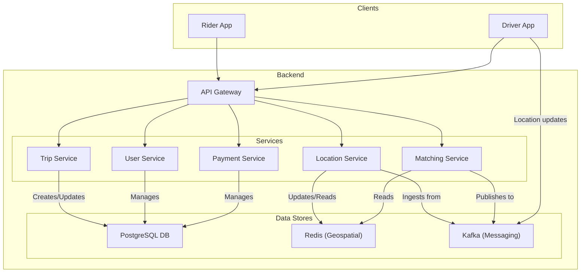
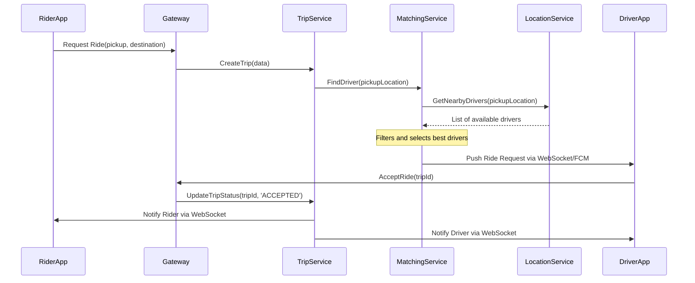
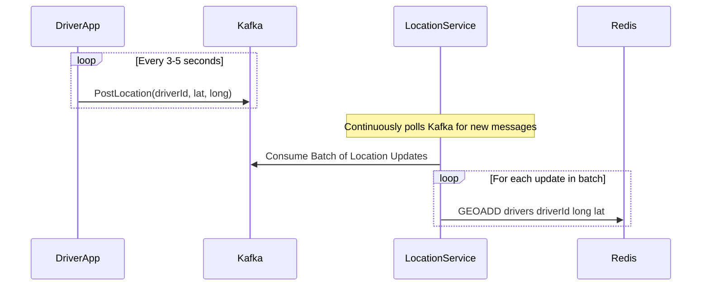

# System Design: Ride-Sharing App (Uber/Lyft)

This document outlines the architecture for a large-scale ride-sharing application. The system is designed to connect millions of riders with drivers, manage real-time location tracking, and handle the entire trip lifecycle from request to payment.

## 1. Core Functional Requirements
*   Riders can request a ride from their location to a destination.
*   Drivers can see nearby ride requests and accept them.
*   The system must match riders with the nearest available drivers.
*   Real-time location of drivers must be visible to riders.
*   The trip lifecycle (ongoing, completed, canceled) must be tracked.
*   Pricing must be calculated and payments processed.
*   Users should be able to rate each other after a trip.

## 2. High-Level Architecture (Microservices)

A microservices architecture is essential for scalability and maintainability. Clients (Rider and Driver apps) communicate with the backend via an API Gateway, which routes requests to the appropriate service.

### Architectural Diagram


## 3. Core Services & Responsibilities

*   **API Gateway**: The single entry point for all client requests. Handles authentication, rate limiting, and routing. It also manages persistent WebSocket connections for real-time communication.
*   **User Service**: Manages user profiles, authentication, and ratings for both riders and drivers.
*   **Location Service**: This is a high-throughput service responsible for ingesting and processing real-time GPS data from driver apps. It uses a message queue like **Kafka** to handle the massive volume of incoming location updates and **Redis** with its geospatial indexes (`GEOADD`, `GEORADIUS`) for fast querying of nearby drivers.
*   **Matching Service**: The brain of the system. It takes a ride request and finds the most suitable driver. The logic involves:
    1.  Querying the `Location Service` for available drivers within a certain radius.
    2.  Filtering drivers based on vehicle type, driver rating, and other criteria.
    3.  Dispatching the ride request to the selected drivers (usually via a message queue).
*   **Trip Service**: Manages the state machine of a trip (e.g., `REQUESTED`, `ACCEPTED`, `IN_PROGRESS`, `COMPLETED`, `CANCELED`). It orchestrates interactions between the rider and driver during a trip.
*   **Payment Service**: Integrates with a third-party payment gateway (e.g., Stripe) to handle all payment-related logic.

## 4. API Design

### REST API Endpoints (Gateway)

#### 1. Request a Ride
```http
POST /api/v1/rides
Content-Type: application/json
Authorization: Bearer <rider_token>

Request:
{
  "pickup_latitude": 34.0522,
  "pickup_longitude": -118.2437,
  "destination_latitude": 34.1522,
  "destination_longitude": -118.3437,
  "vehicle_type": "SUV"
}

Response (202 Accepted):
{
  "ride_id": "c7a4e2a0-9b3f-4e0e-a8b8-5b1e4b3e8e1a",
  "status": "SEARCHING",
  "estimated_fare": 25.50,
  "created_at": "2026-01-18T09:00:00Z"
}
```

#### 2. Get Ride Status
```http
GET /api/v1/rides/{ride_id}
Authorization: Bearer <rider_or_driver_token>

Response (200 OK):
{
  "ride_id": "c7a4e2a0-9b3f-4e0e-a8b8-5b1e4b3e8e1a",
  "status": "ACCEPTED",
  "driver": {
    "driver_id": "d1c2b3a4",
    "name": "John Doe",
    "vehicle_plate": "UBER-123",
    "rating": 4.9
  },
  "current_latitude": 34.0600,
  "current_longitude": -118.2500,
  "eta_minutes": 5
}
```

#### 3. Accept a Ride
```http
POST /api/v1/rides/{ride_id}/accept
Content-Type: application/json
Authorization: Bearer <driver_token>

Request:
{
  "driver_id": "d1c2b3a4"
}

Response (200 OK):
{
  "ride_id": "c7a4e2a0-9b3f-4e0e-a8b8-5b1e4b3e8e1a",
  "status": "ACCEPTED",
  "message": "Ride accepted successfully."
}
```

#### 4. Update Driver Location
(Note: In a real system, this would be a high-throughput endpoint likely using UDP or a lightweight protocol, not a standard REST API, and would route to Kafka.)
```http
POST /api/v1/drivers/{driver_id}/location
Content-Type: application/json
Authorization: Bearer <driver_token>

Request:
{
  "latitude": 34.0522,
  "longitude": -118.2437,
  "timestamp": "2026-01-18T09:01:00Z"
}

Response (204 No Content)
```

## 5. Database Design

### PostgreSQL Schema (Primary Database)

#### Users Table
(Stores info for both Riders and Drivers)
```sql
CREATE TYPE user_role AS ENUM ('rider', 'driver');

CREATE TABLE users (
    id BIGSERIAL PRIMARY KEY,
    full_name VARCHAR(100) NOT NULL,
    email VARCHAR(255) UNIQUE NOT NULL,
    password_hash VARCHAR(255) NOT NULL,
    phone_number VARCHAR(20) UNIQUE NOT NULL,
    role user_role NOT NULL,
    rating NUMERIC(3, 2) DEFAULT 5.0,
    created_at TIMESTAMP WITH TIME ZONE DEFAULT CURRENT_TIMESTAMP
);
```

#### Drivers_Details Table
```sql
CREATE TABLE driver_details (
    driver_id BIGINT PRIMARY KEY REFERENCES users(id),
    vehicle_make VARCHAR(50),
    vehicle_model VARCHAR(50),
    vehicle_plate VARCHAR(20) UNIQUE,
    vehicle_type VARCHAR(20),
    is_available BOOLEAN DEFAULT TRUE,
    
    INDEX idx_driver_availability (is_available)
);
```

#### Rides Table
```sql
CREATE TYPE ride_status AS ENUM ('SEARCHING', 'ACCEPTED', 'IN_PROGRESS', 'COMPLETED', 'CANCELED_RIDER', 'CANCELED_DRIVER');

CREATE TABLE rides (
    id UUID PRIMARY KEY DEFAULT gen_random_uuid(),
    rider_id BIGINT NOT NULL REFERENCES users(id),
    driver_id BIGINT REFERENCES users(id),
    
    pickup_location GEOGRAPHY(Point, 4326),
    destination_location GEOGRAPHY(Point, 4326),
    
    status ride_status NOT NULL,
    fare NUMERIC(10, 2),
    
    requested_at TIMESTAMP WITH TIME ZONE DEFAULT CURRENT_TIMESTAMP,
    accepted_at TIMESTAMP WITH TIME ZONE,
    started_at TIMESTAMP WITH TIME ZONE,
    completed_at TIMESTAMP WITH TIME ZONE,
    
    INDEX idx_rider_id (rider_id),
    INDEX idx_driver_id (driver_id),
    INDEX idx_ride_status (status)
);
```

## 6. Detailed Data Flows

### A. Ride Request Flow

This flow describes the process from a rider requesting a trip to a driver accepting it.



### B. Location Update Flow

This flow must be highly optimized for millions of drivers sending updates every few seconds.



## 7. Key Challenges & Considerations

*   **Scalability of Location Service**: Using Kafka as a buffer is critical to prevent the `Location Service` from being overwhelmed by the high frequency of driver location updates.
*   **Matchmaking Logic**: The `Matching Service` algorithm must be efficient and fair. It can't just find the nearest driver; it must also consider factors like traffic, driver availability, and potential earnings to avoid driver churn.
*   **Reliability**: Using message queues and asynchronous communication ensures that if a service is temporarily down, the requests are not lost and can be processed once the service recovers.
*   **Concurrency**: When a ride is offered to multiple drivers, the first one to accept wins. The `Trip Service` must handle this race condition atomically to ensure the trip is only assigned once.