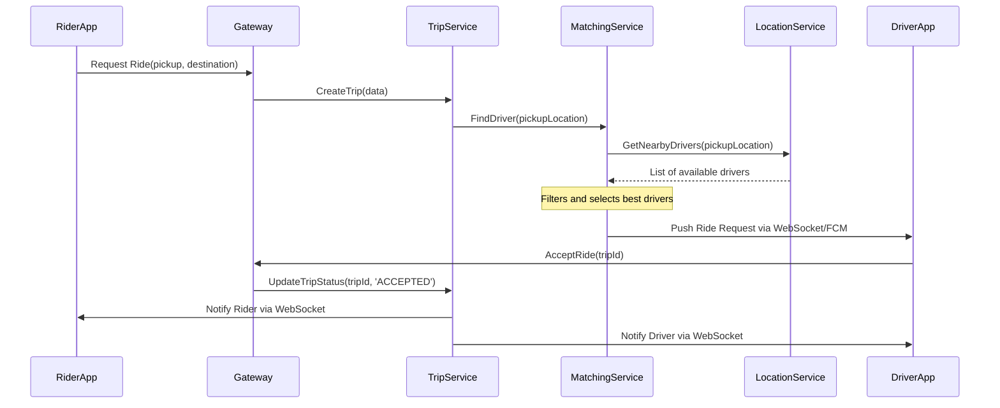
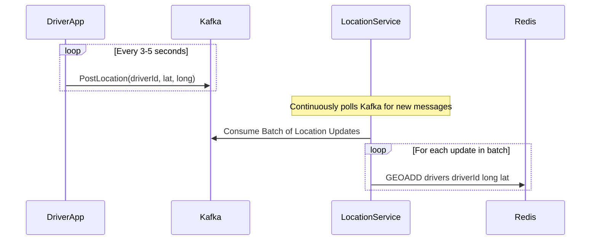

# System Design: Ride-Sharing App (Uber/Lyft)

This document outlines the architecture for a large-scale ride-sharing application. The system is designed to connect millions of riders with drivers, manage real-time location tracking, and handle the entire trip lifecycle from request to payment.

## 1. Core Functional Requirements
*   Riders can request a ride from their location to a destination.
*   Drivers can see nearby ride requests and accept them.
*   The system must match riders with the nearest available drivers.
*   Real-time location of drivers must be visible to riders.
*   The trip lifecycle (ongoing, completed, canceled) must be tracked.
*   Pricing must be calculated and payments processed.
*   Users should be able to rate each other after a trip.

## 2. High-Level Architecture (Microservices)

A microservices architecture is essential for scalability and maintainability. Clients (Rider and Driver apps) communicate with the backend via an API Gateway, which routes requests to the appropriate service.

### Architectural Diagram
```mermaid
graph TD
    subgraph Clients
        A[Rider App]
        B[Driver App]
    end

    subgraph Backend
        C[API Gateway]
        
        subgraph Services
            D[Trip Service]
            E[Matching Service]
            F[Location Service]
            G[User Service]
            H[Payment Service]
        end

        subgraph Data Stores
            I[PostgreSQL DB]
            J[Redis (Geospatial)]
            K[Kafka (Messaging)]
        end
    end
    
    A --> C
    B --> C
    
    C --> D; C --> E; C --> F; C --> G; C --> H

    D -- Creates/Updates --> I
    G -- Manages --> I
    H -- Manages --> I

    F -- Updates/Reads --> J
    E -- Reads --> J
    F -- Ingests from --> K
    
    E -- Publishes to --> K
    
    B -- Location updates --> K
```

## 3. Core Services & Responsibilities

*   **API Gateway**: The single entry point for all client requests. Handles authentication, rate limiting, and routing. It also manages persistent WebSocket connections for real-time communication.
*   **User Service**: Manages user profiles, authentication, and ratings for both riders and drivers.
*   **Location Service**: This is a high-throughput service responsible for ingesting and processing real-time GPS data from driver apps. It uses a message queue like **Kafka** to handle the massive volume of incoming location updates and **Redis** with its geospatial indexes (`GEOADD`, `GEORADIUS`) for fast querying of nearby drivers.
*   **Matching Service**: The brain of the system. It takes a ride request and finds the most suitable driver. The logic involves:
    1.  Querying the `Location Service` for available drivers within a certain radius.
    2.  Filtering drivers based on vehicle type, driver rating, and other criteria.
    3.  Dispatching the ride request to the selected drivers (usually via a message queue).
*   **Trip Service**: Manages the state machine of a trip (e.g., `REQUESTED`, `ACCEPTED`, `IN_PROGRESS`, `COMPLETED`, `CANCELED`). It orchestrates interactions between the rider and driver during a trip.
*   **Payment Service**: Integrates with a third-party payment gateway (e.g., Stripe) to handle all payment-related logic.

## 4. Detailed Data Flows

### A. Ride Request Flow

This flow describes the process from a rider requesting a trip to a driver accepting it.



### B. Location Update Flow

This flow must be highly optimized for millions of drivers sending updates every few seconds.



## 5. Key Challenges & Considerations

*   **Scalability of Location Service**: Using Kafka as a buffer is critical to prevent the `Location Service` from being overwhelmed by the high frequency of driver location updates.
*   **Matchmaking Logic**: The `Matching Service` algorithm must be efficient and fair. It can't just find the nearest driver; it must also consider factors like traffic, driver availability, and potential earnings to avoid driver churn.
*   **Reliability**: Using message queues and asynchronous communication ensures that if a service is temporarily down, the requests are not lost and can be processed once the service recovers.
*   **Concurrency**: When a ride is offered to multiple drivers, the first one to accept wins. The `Trip Service` must handle this race condition atomically to ensure the trip is only assigned once.
