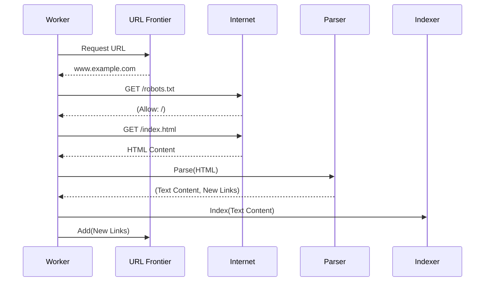

# System Design: Web Crawler (Googlebot)

This document outlines the architecture for a distributed, scalable web crawler designed to discover and index content from the internet. The system is built to handle billions of URLs, respect server policies, and process content for a search engine.

## 1. Core Functional Requirements

*   **Crawling**: Discover and fetch webpages from the internet, starting from a set of seed URLs.
*   **Indexing**: Process and store the content of crawled pages to be used by a search engine.
*   **Scalability**: The system must be able to crawl a significant portion of the web, handling trillions of documents.
*   **Politeness**: The crawler must not overload web servers; it must respect `robots.txt` and limit its request rate per domain.
*   **Extensibility**: The system should be able to handle different content types (HTML, PDF, images, etc.).

## 2. High-Level Architecture

A web crawler is a complex distributed system composed of several key components that work in a continuous loop.

### Architectural Diagram

```mermaid
graph TD
    A[Seed URLs] --> B(URL Frontier);
    
    subgraph "Crawler Workers (Fleet)"
        C{Crawler Worker 1}
        D{Crawler Worker 2}
        E{...}
        F{Crawler Worker N}
    end

    B -- Distributes URLs to --> C;
    B -- Distributes URLs to --> D;
    B -- Distributes URLs to --> E;
    B -- Distributes URLs to --> F;

    C -- Fetches page from --> G[The Internet];
    
    subgraph "Processing Pipeline"
        H[DNS Resolver]
        I[robots.txt Cache]
        J[Content Parser]
        K[Duplicate Detector]
        L[Link Extractor]
    end

    C --> H; C --> I;
    C -- Raw HTML --> J;
    J -- Text Content --> K;
    J -- Links --> L;
    
    L -- New URLs --> B;
    
    subgraph "Storage & Indexing"
        M[Content Store (S3/HDFS)]
        N[Search Indexer]
        O[Search Index (Elasticsearch)]
    end
    
    K -- Unique Content --> M;
    K -- Unique Content --> N;
    N -- Builds/Updates --> O;
```

## 3. Core Components & Responsibilities

*   **Seed URLs**: The starting point of the crawl. A list of high-quality, reputable URLs (e.g., major news sites, university homepages) are used to bootstrap the process.

*   **URL Frontier**: The heart of the crawler. It's a sophisticated data manager for all the URLs that have been discovered and need to be crawled. Its key responsibilities are:
    *   **URL Storage**: Manages a massive list of URLs to visit.
    *   **Prioritization**: Decides which page to crawl next. Priority can be based on PageRank, update frequency, or other metrics.
    *   **Politeness**: Ensures that the crawler doesn't hit the same web server too frequently. It maintains a mapping of hostnames to queues and only dispenses a URL for a specific host after a politeness delay has passed.

*   **Crawler Workers**: A large fleet of distributed machines that perform the actual crawling task. Each worker executes the following loop:
    1.  Request a batch of URLs from the URL Frontier.
    2.  For each URL, perform a DNS lookup via the **DNS Resolver**.
    3.  Fetch the `robots.txt` file for the domain (and cache it) to check if crawling is allowed.
    4.  If allowed, download the HTML content of the page.

*   **Content Parser**: Once a page is downloaded, the parser extracts the important information:
    *   **Text Content**: The raw text that will be indexed.
    *   **Links**: All hyperlink URLs (`<a href=... >`) found on the page.

*   **Link Extractor**: Normalizes the extracted links (e.g., converting relative URLs to absolute ones) and sends them back to the URL Frontier to be scheduled for future crawling.

*   **Duplicate Detector**: To save storage and processing time, we must avoid indexing the same content multiple times. This component calculates a hash (e.g., a 64-bit checksum) of the page's content and checks if it has been seen before. If the content is new, it's passed on; otherwise, it's discarded.

*   **Content Store**: A distributed, high-volume storage system like Amazon S3 or HDFS that stores the raw HTML of every unique page crawled.

*   **Search Indexer**: This component receives the unique content, processes it (tokenization, stemming, stop-word removal), and builds a reverse index. A reverse index maps words to the documents that contain them, which is the fundamental data structure for fast keyword searching.

## 4. The Crawling Workflow



## 5. Key Challenges and Solutions

*   **Scalability (The Scale of the Web)**: The system must be distributed from the ground up. The URL Frontier, Crawler Workers, and Indexing pipeline are all designed as independent, scalable services.
*   **Politeness**: Overloading web servers is unethical and can get the crawler blocked. The URL Frontier is the central enforcer of politeness. It uses a scheduler with per-hostname queues, ensuring that requests to a single host are spaced out by a configured delay (e.g., a few seconds).
*   **Crawler Traps**: Some websites have dynamically generated pages that can create an infinite number of URLs (e.g., a calendar with a "next month" link). The crawler must detect these patterns, often by looking for URLs with excessively long paths or many repeating parameters, and avoid getting stuck.
*   **Content Freshness**: Web pages are constantly changing. The URL Frontier must prioritize re-crawling important pages more frequently than static ones. This is often based on historical change frequency and the page's overall importance (PageRank).
*   **Data Duplication**: The web is full of duplicate and near-duplicate content. Using checksums or more advanced shingling algorithms is essential to detect this and conserve resources.
