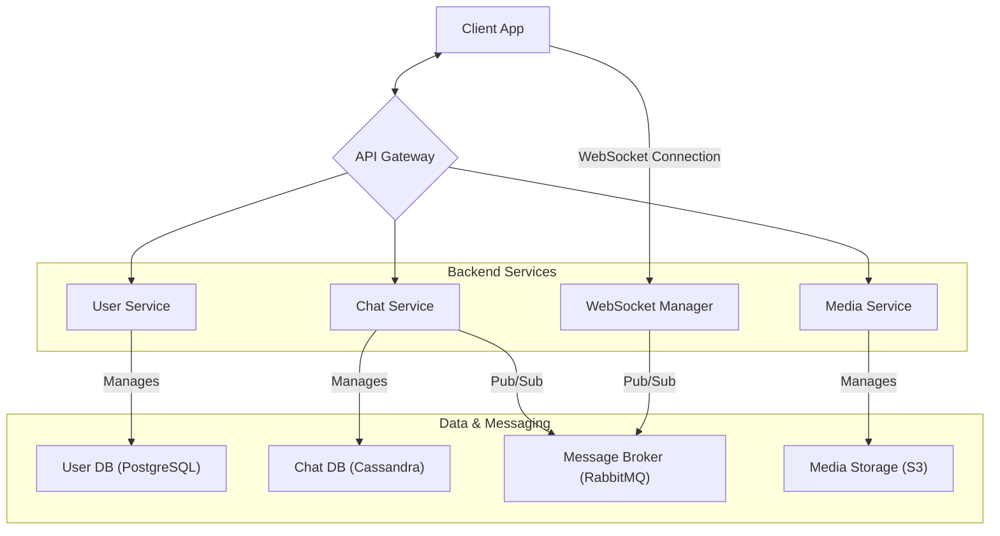
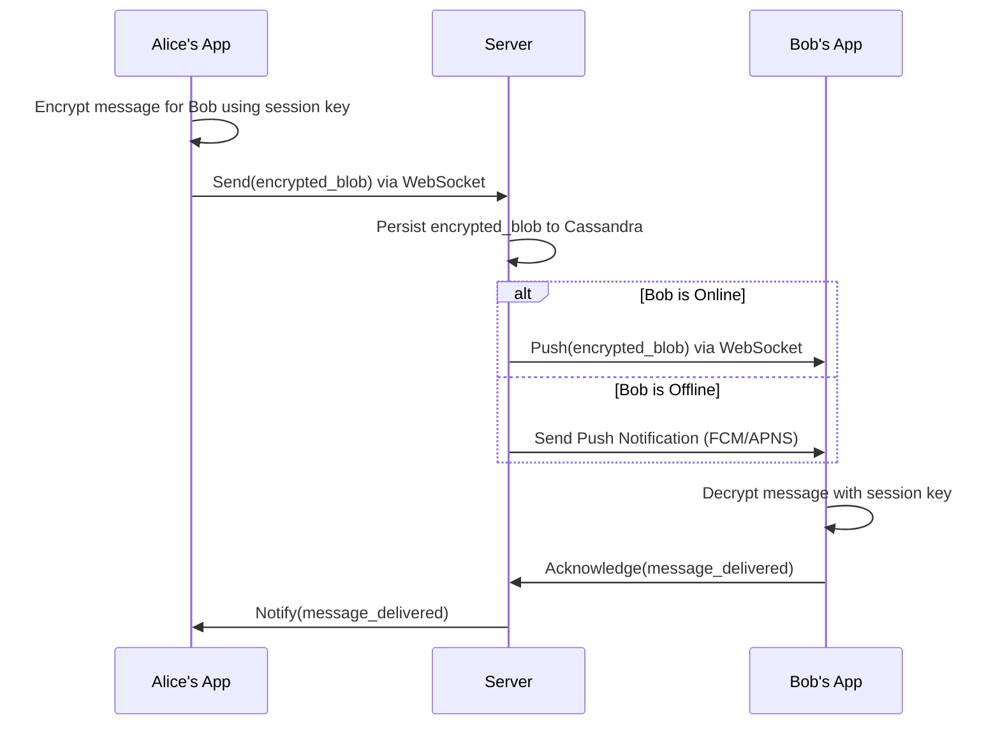

# System Design: Real-Time Messaging App (WhatsApp)

This document outlines the architecture for a large-scale, end-to-end encrypted (E2EE) messaging application like WhatsApp. The design prioritizes security, reliability, and low-latency communication.

## 1. Core Functional Requirements
*   **1-on-1 Chat**: Users can send and receive messages in real-time.
*   **Group Chat**: Support for conversations with multiple participants.
*   **Message Status**: Display message status: `sending`, `sent` (to server), `delivered` (to recipient), and `read`.
*   **End-to-End Encryption (E2EE)**: The server must never be able to read message content.
*   **Media Sharing**: Users can send images, videos, and other files.
*   **Offline Support**: Users can view past messages and send new ones even when offline.

## 2. High-Level Architecture

The system uses a combination of WebSockets for real-time communication and a REST API for less frequent actions. The core security is provided by the **Signal Protocol** for E2EE.

### Architectural Diagram

## 3. Core Components & Logic

*   **API Gateway**: Handles standard HTTP requests for actions like user login, profile updates, and fetching contacts.
*   **WebSocket Manager**: Manages persistent, low-latency WebSocket connections for millions of concurrent users. It's responsible for routing real-time messages between clients.
*   **Chat Service**: The main business logic for messaging. It receives messages, determines the recipient(s), and pushes them into a message broker for delivery. It also persists messages to a database.
*   **Media Service**: Handles the storage and retrieval of media files. It generates pre-signed URLs for clients to upload/download files directly to/from S3, offloading bandwidth from the service itself.
*   **Message Broker (RabbitMQ/Kafka)**: Decouples the incoming messages from the WebSocket delivery system. This adds resilience and allows services to scale independently. The `Chat Service` publishes a message, and the `WebSocket Manager` subscribes to relevant topics/queues to deliver it to the correct client.
*   **Databases**:
    *   **Cassandra** is used for the chat history due to its high write throughput and horizontal scalability, which is perfect for time-series data like messages.
    *   **PostgreSQL** is used for relational data like user profiles and contact lists.

## 4. End-to-End Encryption (E2EE) Deep Dive

E2EE ensures that only the sender and intended recipient(s) can read the message content.

1.  **Key Generation**: Each user generates a set of public and private keys on their device upon registration. The public keys are uploaded to the server.
2.  **Session Establishment (Signal Protocol)**: When User A wants to message User B for the first time, User A's app requests User B's public keys from the server. It uses these keys to establish a shared secret key for an encrypted session.
3.  **Double Ratchet Algorithm**: For subsequent messages, this algorithm is used to generate a new encryption key for *every single message*. This provides forward secrecy (if a key is compromised, past messages remain secure) and post-compromise security.
4.  **The Server's Role**: The server only sees encrypted ciphertext. Its job is to store and forward these encrypted blobs to the correct recipients. It has no ability to decrypt them.

## 5. Detailed Data Flows

### A. Sending a Message

### B. Media Sharing Flow

Media files are also end-to-end encrypted.

1.  **Client-Side Encryption**: The sending client generates a random symmetric key (e.g., AES-256) and encrypts the media file with it.
2.  **Upload Encrypted File**: The client gets a pre-signed URL from the `Media Service` and uploads the *encrypted* file to S3.
3.  **Send Key in a Message**: The client sends a regular chat message to the recipient containing two things: the URL of the encrypted file and the symmetric key used to encrypt it. This message itself is E2E encrypted with the Signal Protocol.
4.  **Download and Decrypt**: The recipient's app receives the message, decrypts it to get the URL and the key, downloads the encrypted file from S3, and then decrypts the file locally for viewing.

## 6. Key Challenges

*   **Scalability of Connections**: Maintaining millions of persistent WebSocket connections is a major engineering challenge. The `WebSocket Manager` needs to be a distributed, load-balanced fleet of servers with connection state often shared via a fast cache like Redis.
*   **E2EE in Group Chats**: E2EE in group chats is more complex. A shared group encryption key is established. When a member is added or removed, this key must be securely renegotiated for all remaining members.
*   **Offline Delivery**: When a user is offline, the server stores the encrypted messages and delivers them as soon as the user reconnects. Push notifications are used to wake the client app if it's in the background.
*   **Data Storage**: Storing trillions of messages requires a highly scalable, write-optimized database. Cassandra's architecture is an excellent fit for this use case.
