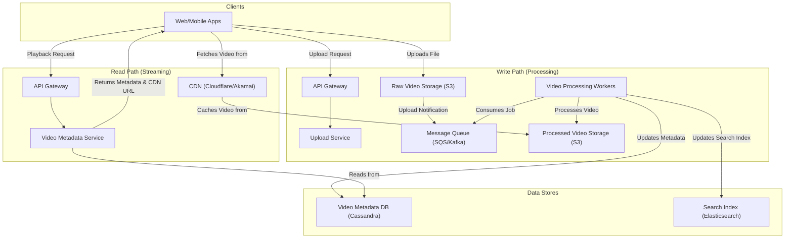

# System Design: Video Streaming Service (YouTube)

This document outlines the architecture for a large-scale video streaming platform like YouTube or Netflix. The design covers the entire lifecycle of a video from upload and processing to delivery and playback on a global scale.

## 1. Core Functional Requirements
*   **Video Upload**: Users can upload raw video files.
*   **Video Playback**: Users can stream videos smoothly from any device.
*   **Video Quality**: Users should be able to select different video qualities (e.g., 480p, 720p, 1080p). The player should also adapt the quality automatically based on network conditions (Adaptive Bitrate Streaming).
*   **Metadata**: Users can provide a title, description, and other metadata for their videos.
*   **Search & Discovery**: Users can search for videos and get personalized recommendations.

## 2. High-Level Architecture

The architecture is split into two main workflows: the **Video Upload/Processing Pipeline** (write path) and the **Video Streaming Pipeline** (read path). The system relies heavily on a **Content Delivery Network (CDN)** for low-latency video delivery.

### Architectural Diagram


## 3. API Design

### REST API Endpoints (Gateway)

#### 1. Get Pre-signed URL for Upload
```http
POST /api/v1/videos/upload
Content-Type: application/json
Authorization: Bearer <user_token>

Request:
{
  "file_name": "my_vacation.mp4",
  "file_type": "video/mp4",
  "file_size": 52428800
}

Response (200 OK):
{
  "video_id": "a1b2c3d4-e5f6-7890-1234-567890abcdef",
  "upload_url": "https://my-raw-videos-bucket.s3.amazonaws.com/..."
}
```

#### 2. Update Video Metadata
(Called after upload is complete)
```http
PUT /api/v1/videos/{video_id}
Content-Type: application/json
Authorization: Bearer <user_token>

Request:
{
  "title": "My Awesome Vacation Video",
  "description": "A video of my trip to the mountains.",
  "tags": ["travel", "vacation", "mountains"],
  "privacy": "public"
}

Response (200 OK):
{
  "video_id": "a1b2c3d4-e5f6-7890-1234-567890abcdef",
  "status": "PROCESSING"
}
```

#### 3. Get Video Playback Info
```http
GET /api/v1/videos/{video_id}

Response (200 OK):
{
  "video_id": "a1b2c3d4-e5f6-7890-1234-567890abcdef",
  "title": "My Awesome Vacation Video",
  "author": "John Doe",
  "view_count": 10542,
  "like_count": 876,
  "manifest_url_hls": "https://cdn.mysite.com/videos/a1b2c3d4/master.m3u8",
  "manifest_url_dash": "https://cdn.mysite.com/videos/a1b2c3d4/master.mpd",
  "comments": [],
  "recommendations": []
}
```

#### 4. Post a Comment
```http
POST /api/v1/videos/{video_id}/comments
Content-Type: application/json
Authorization: Bearer <user_token>

Request:
{
  "comment_text": "Great video!"
}

Response (201 Created):
{
  "comment_id": "comment-xyz-789",
  "user_id": "user123",
  "comment_text": "Great video!",
  "timestamp": "2026-01-18T10:00:00Z"
}
```

## 4. Database Design

### Cassandra Schema (Primary Database for Video Data)

(Cassandra is chosen for its high write throughput and linear scalability, ideal for handling massive amounts of video metadata, comments, and user interactions.)

#### videos Table
```cql
CREATE TABLE videos (
    video_id UUID PRIMARY KEY,
    uploader_id UUID,
    title TEXT,
    description TEXT,
    tags SET<TEXT>,
    privacy TEXT, // 'public', 'private', 'unlisted'
    upload_timestamp TIMESTAMP,
    processing_status TEXT, // 'UPLOADING', 'PROCESSING', 'COMPLETED', 'FAILED'
    manifest_urls MAP<TEXT, TEXT> // e.g., {'hls': '...', 'dash': '...'}
);
```

#### video_stats Table
```cql
CREATE TABLE video_stats (
    video_id UUID PRIMARY KEY,
    view_count COUNTER,
    like_count COUNTER,
    comment_count COUNTER
);
-- Note: Using Cassandra's COUNTER type for efficient, non-blocking increments.
```

#### comments_by_video Table
(Partitioned by `video_id` and clustered by `comment_id` for time-series retrieval)
```cql
CREATE TABLE comments_by_video (
    video_id UUID,
    comment_id TIMEUUID,
    user_id UUID,
    user_name TEXT,
    comment_text TEXT,
    PRIMARY KEY (video_id, comment_id)
) WITH CLUSTERING ORDER BY (comment_id DESC);
```

### PostgreSQL Schema (For User Data)

#### users Table
```sql
CREATE TABLE users (
    id UUID PRIMARY KEY DEFAULT gen_random_uuid(),
    username VARCHAR(50) UNIQUE NOT NULL,
    email VARCHAR(255) UNIQUE NOT NULL,
    password_hash VARCHAR(255) NOT NULL,
    channel_description TEXT,
    created_at TIMESTAMP WITH TIME ZONE DEFAULT CURRENT_TIMESTAMP
);
```

## 5. Detailed Data Flows

### A. Video Upload & Processing Pipeline (Asynchronous)

This workflow is asynchronous to handle long-running and computationally expensive video processing tasks without blocking the user.

1.  **Upload Initiation**: The client app calls our API to signal its intent to upload a video. The `Upload Service` returns a unique video ID and a secure, pre-signed URL to upload directly to a raw files bucket in **Amazon S3**.
2.  **Direct Upload**: The client uploads the large video file directly to the S3 bucket. This offloads the bandwidth-intensive work from our servers.
3.  **Trigger Processing**: The S3 bucket is configured to send an event notification to a **Message Queue** (like AWS SQS) upon a successful upload. The message contains the video ID and its location in the raw storage bucket.
4.  **Video Processing Workers**: A fleet of worker services (e.g., EC2 instances or Lambda functions) constantly poll the message queue for new jobs.
5.  **Transcoding & Segmentation**: When a worker receives a job, it downloads the raw video file and performs several crucial tasks:
    *   **Transcoding**: Converts the video into various formats (e.g., MP4, WebM) and resolutions (1080p, 720p, 480p, etc.).
    *   **Adaptive Bitrate Streaming (ABS)**: Chops the transcoded videos into small, multi-second segments (e.g., `.ts` files). It also creates a manifest file (e.g., `.m3u8` for HLS) that lists all the available segments and their corresponding bitrates.
    *   **Thumbnail Generation**: Extracts several thumbnails from the video.
6.  **Store Processed Files**: The worker uploads all the generated segments and the manifest file to a separate, public-facing S3 bucket that is connected to the CDN.
7.  **Update Metadata**: The worker updates the `Video Metadata Database` with the status `PROCESSED` and the URL to the manifest file on the CDN.

### B. Video Streaming Pipeline

This workflow is optimized for low-latency, high-availability reads on a global scale.

1.  **Fetch Metadata**: The user clicks play. The client app calls the `Video Metadata Service` with the video ID.
2.  **Return Manifest URL**: The service retrieves the video's metadata, including the **CDN URL** for the master manifest file (`master.m3u8`).
3.  **Player Fetches Manifest**: The client's video player fetches this manifest file from the nearest CDN edge location.
4.  **Adaptive Streaming**: The manifest file tells the player about the available quality streams. The player selects the most appropriate stream based on the device's screen size and current network bandwidth.
5.  **Fetch and Play Segments**: The player fetches the video segments sequentially from the CDN and plays them. It continuously monitors network conditions and can seamlessly switch to a higher or lower quality stream by fetching segments from a different bitrate playlist, ensuring a smooth playback experience. The **CDN** is the hero here, caching the video segments at edge locations close to the user, which dramatically reduces latency.

## 6. Key Design Choices & Technologies

*   **Content Delivery Network (CDN)**: This is the most critical component. A CDN distributes and caches video content across thousands of servers globally. When a user requests a video, it is served from the nearest "edge" server, ensuring minimal latency.
*   **Object Storage (S3)**: S3 is used for storing video files due to its high durability, scalability, and cost-effectiveness. We use two buckets: one for raw uploads and another for processed, publicly-served content.
*   **Asynchronous Processing**: Using a message queue decouples the upload process from the CPU-intensive processing, allowing the system to scale the number of workers based on the queue depth.
*   **Adaptive Bitrate Streaming (ABS)**: Protocols like **HLS** (HTTP Live Streaming) and **DASH** are the industry standard. They allow the video player to adapt to changing network conditions, providing the best possible video quality without buffering.
*   **Database Choice**:
    *   **Video Metadata**: A NoSQL database like **Cassandra** or **DynamoDB** is ideal. It can handle a very high write load (likes, view counts) and scales horizontally.
    *   **Search**: **Elasticsearch** is used to index video metadata (titles, descriptions, tags) to provide powerful full-text search capabilities.