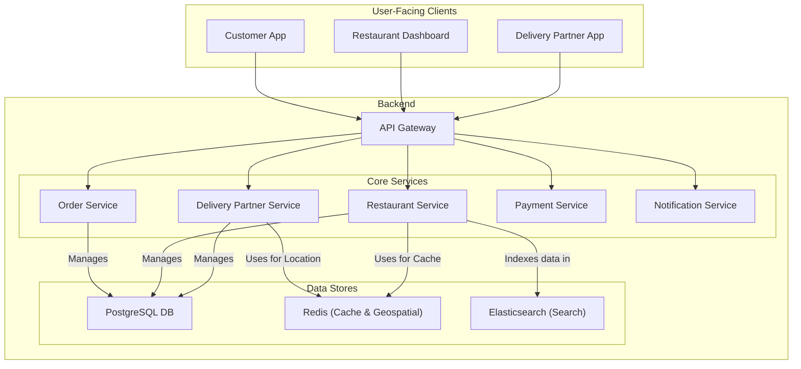
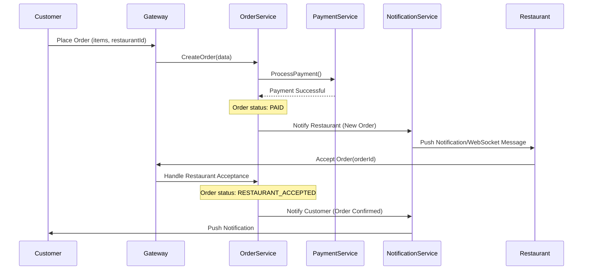
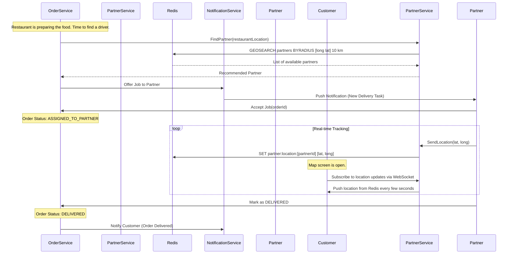

# System Design: Online Food Delivery System (Zomato/Uber Eats)

This document outlines the architecture for a three-sided online food delivery marketplace connecting Customers, Restaurants, and Delivery Partners. The system is designed for high concurrency, real-time tracking, and reliability.

## 1. Core Functional Requirements

*   **Customers**: Can browse restaurants, view menus, place orders, make payments, and track their order in real-time.
*   **Restaurants**: Can manage their menu, pricing, and availability. They can accept or reject incoming orders.
*   **Delivery Partners**: Can view and accept available delivery tasks, see pickup and drop-off locations, and track their earnings.

## 2. High-Level Architecture (Microservices)

The system is a classic three-sided marketplace. A microservices architecture is ideal for separating the distinct concerns of each user type and the core order lifecycle.

### Architectural Diagram

## 3. Core Services & Responsibilities

*   **API Gateway**: A single entry point that handles requests from all three client types. It manages authentication, routing, and WebSocket connections for real-time updates.
*   **Restaurant Service**: Manages all restaurant-related data, including menus, operating hours, locations, and cuisines. It also provides an interface for restaurants to update their information. Data is indexed in **Elasticsearch** for search and discovery.
*   **Order Service**: The central orchestrator of the entire system. It manages the state machine for an order: `CREATED`, `PAID`, `RESTAURANT_ACCEPTED`, `PREPARING`, `READY_FOR_PICKUP`, `ASSIGNED_TO_PARTNER`, `PICKED_UP`, `DELIVERED`, `CANCELED`.
*   **Delivery Partner Service**: Manages profiles, availability, and real-time location of delivery partners. It uses **Redis** with geospatial indexes to efficiently find available partners near a specific restaurant.
*   **Payment Service**: Integrates with payment gateways like Stripe or Adyen to process customer payments and handle payouts to restaurants and delivery partners.
*   **Notification Service**: A crucial service that sends real-time updates to all parties. It uses multiple channels:
    *   **Push Notifications (FCM/APNS)**: For critical alerts (e.g., "New Order," "Order Delivered").
    *   **WebSockets**: For pushing continuous location updates of the delivery partner to the customer's app.
    *   **SMS/Email**: For receipts and non-urgent communication.

## 4. Detailed Data Flows

### A. Order Placement and Restaurant Confirmation

### B. Delivery Partner Assignment & Real-Time Tracking

This flow begins right after the restaurant accepts the order.

## 5. Key Challenges & Design Choices

*   **The Three-Way Coordination**: The biggest challenge is orchestrating the workflow between three different actors who all have different states and applications. The `Order Service` acts as the central state machine and source of truth, and the `Notification Service` is the communication backbone that keeps everyone in sync.
*   **Real-Time Location Tracking**: Pushing location data from thousands of delivery partners every few seconds is write-heavy. Using Redis for this is ideal, as it's an in-memory data store designed for extremely fast reads and writes. The customer app can then poll or use a WebSocket to get this location data without hitting the primary database.
*   **Restaurant Availability**: Restaurants can go offline or become too busy to accept new orders. The `Restaurant Service` needs to manage this state, and the customer-facing app must reflect it in real-time to avoid user frustration.
*   **Scalability**: Each service is designed to be independently scalable. If order volume surges, we can scale up the `Order Service` and `Delivery Partner Service` instances without impacting the `Restaurant Service`.
