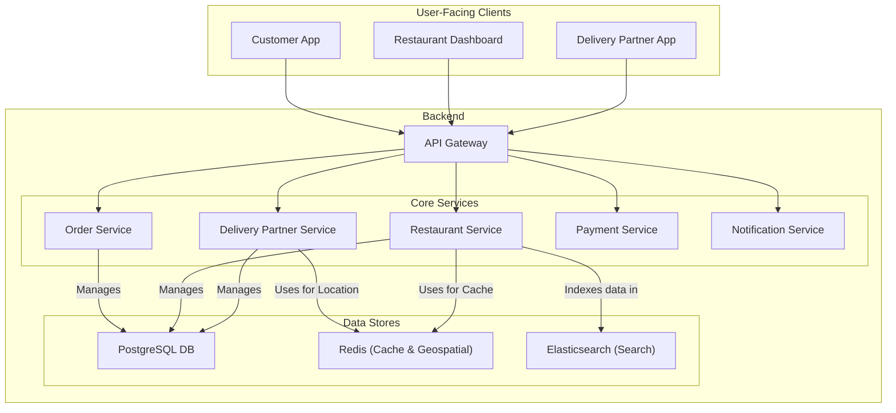
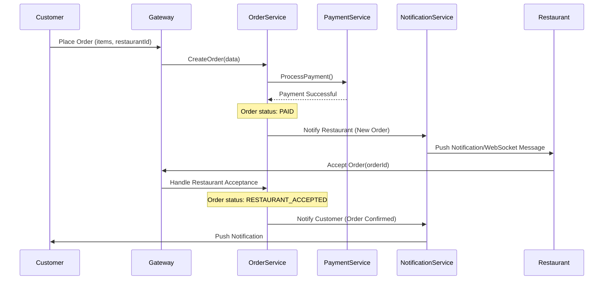
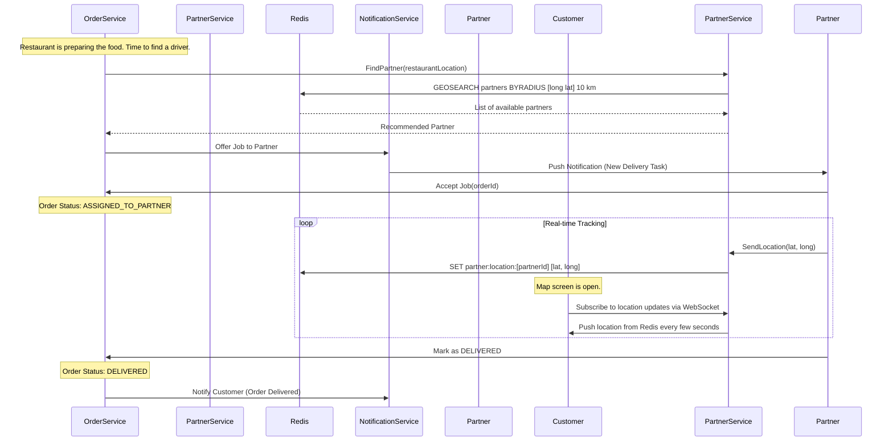

# System Design: Online Food Delivery System (Zomato/Uber Eats)

This document outlines the architecture for a three-sided online food delivery marketplace connecting Customers, Restaurants, and Delivery Partners. The system is designed for high concurrency, real-time tracking, and reliability.

## 1. Core Functional Requirements

*   **Customers**: Can browse restaurants, view menus, place orders, make payments, and track their order in real-time.
*   **Restaurants**: Can manage their menu, pricing, and availability. They can accept or reject incoming orders.
*   **Delivery Partners**: Can view and accept available delivery tasks, see pickup and drop-off locations, and track their earnings.

## 2. High-Level Architecture (Microservices)

The system is a classic three-sided marketplace. A microservices architecture is ideal for separating the distinct concerns of each user type and the core order lifecycle.

### Architectural Diagram



## 3. Core Services & Responsibilities

*   **API Gateway**: A single entry point that handles requests from all three client types. It manages authentication, routing, and WebSocket connections for real-time updates.
*   **Restaurant Service**: Manages all restaurant-related data, including menus, operating hours, locations, and cuisines. It also provides an interface for restaurants to update their information. Data is indexed in **Elasticsearch** for search and discovery.
*   **Order Service**: The central orchestrator of the entire system. It manages the state machine for an order: `CREATED`, `PAID`, `RESTAURANT_ACCEPTED`, `PREPARING`, `READY_FOR_PICKUP`, `ASSIGNED_TO_PARTNER`, `PICKED_UP`, `DELIVERED`, `CANCELED`.
*   **Delivery Partner Service**: Manages profiles, availability, and real-time location of delivery partners. It uses **Redis** with geospatial indexes to efficiently find available partners near a specific restaurant.
*   **Payment Service**: Integrates with payment gateways like Stripe or Adyen to process customer payments and handle payouts to restaurants and delivery partners.
*   **Notification Service**: A crucial service that sends real-time updates to all parties. It uses multiple channels:
    *   **Push Notifications (FCM/APNS)**: For critical alerts (e.g., "New Order," "Order Delivered").
    *   **WebSockets**: For pushing continuous location updates of the delivery partner to the customer's app.
    *   **SMS/Email**: For receipts and non-urgent communication.

## 4. API Design

### REST API Endpoints (Gateway)

#### 1. Place an Order
```http
POST /api/v1/orders
Content-Type: application/json
Authorization: Bearer <customer_token>

Request:
{
  "customer_id": "cust-123",
  "restaurant_id": "rest-456",
  "items": [
    { "menu_item_id": "item-abc", "quantity": 2 },
    { "menu_item_id": "item-def", "quantity": 1 }
  ],
  "delivery_address": "123 Food Street",
  "payment_token": "tok_visa_4242"
}

Response (202 Accepted):
{
  "order_id": "ord-789-xyz",
  "status": "PAYMENT_CONFIRMED",
  "estimated_delivery_time": "35 minutes"
}
```

#### 2. Get Order Status
```http
GET /api/v1/orders/{order_id}
Authorization: Bearer <customer_token>

Response (200 OK):
{
  "order_id": "ord-789-xyz",
  "status": "PREPARING",
  "restaurant_name": "The Hungry Spot",
  "delivery_partner": null,
  "live_tracking": {
      "latitude": null,
      "longitude": null
  }
}
```

#### 3. Restaurant: Update Order Status
```http
PUT /api/v1/restaurant/orders/{order_id}
Content-Type: application/json
Authorization: Bearer <restaurant_token>

Request:
{
  "status": "READY_FOR_PICKUP"
}

Response (200 OK):
{
  "order_id": "ord-789-xyz",
  "status": "READY_FOR_PICKUP"
}
```

#### 4. Delivery Partner: Update Location
(Note: As with Uber, this is a high-throughput endpoint that would likely use a more lightweight protocol than REST in production.)
```http
POST /api/v1/delivery-partners/{partner_id}/location
Content-Type: application/json
Authorization: Bearer <partner_token>

Request:
{
  "latitude": 12.9716,
  "longitude": 77.5946
}

Response (204 No Content)
```

## 5. Database Design

### PostgreSQL Schema (Primary Database)

#### Restaurants Table
```sql
CREATE TABLE restaurants (
    id BIGSERIAL PRIMARY KEY,
    name VARCHAR(255) NOT NULL,
    address TEXT NOT NULL,
    location GEOGRAPHY(Point, 4326),
    cuisine_type VARCHAR(100),
    rating NUMERIC(3, 2),
    is_open BOOLEAN DEFAULT TRUE
);
```

#### Menu_Items Table
```sql
CREATE TABLE menu_items (
    id BIGSERIAL PRIMARY KEY,
    restaurant_id BIGINT NOT NULL REFERENCES restaurants(id),
    name VARCHAR(255) NOT NULL,
    description TEXT,
    price NUMERIC(10, 2) NOT NULL,
    is_veg BOOLEAN,
    is_available BOOLEAN DEFAULT TRUE
);
```

#### Orders Table
```sql
CREATE TYPE order_status AS ENUM ('CREATED', 'PAYMENT_CONFIRMED', 'RESTAURANT_ACCEPTED', 'PREPARING', 'READY_FOR_PICKUP', 'ASSIGNED_TO_PARTNER', 'PICKED_UP', 'DELIVERED', 'CANCELED');

CREATE TABLE orders (
    id BIGSERIAL PRIMARY KEY,
    customer_id BIGINT NOT NULL REFERENCES users(id),
    restaurant_id BIGINT NOT NULL REFERENCES restaurants(id),
    delivery_partner_id BIGINT REFERENCES users(id),
    status order_status NOT NULL,
    total_amount NUMERIC(10, 2) NOT NULL,
    delivery_address TEXT NOT NULL,
    created_at TIMESTAMP WITH TIME ZONE DEFAULT CURRENT_TIMESTAMP,
    delivered_at TIMESTAMP WITH TIME ZONE
);
```

#### Order_Items Table
(Links orders to menu items)
```sql
CREATE TABLE order_items (
    id BIGSERIAL PRIMARY KEY,
    order_id BIGINT NOT NULL REFERENCES orders(id),
    menu_item_id BIGINT NOT NULL REFERENCES menu_items(id),
    quantity INT NOT NULL,
    price_per_item NUMERIC(10, 2) NOT NULL
);
```

#### Users Table
(For Customers, Restaurant Staff, and Delivery Partners)
```sql
CREATE TYPE user_role AS ENUM ('customer', 'restaurant', 'delivery_partner');

CREATE TABLE users (
    id BIGSERIAL PRIMARY KEY,
    full_name VARCHAR(100) NOT NULL,
    email VARCHAR(255) UNIQUE NOT NULL,
    password_hash VARCHAR(255) NOT NULL,
    phone_number VARCHAR(20) UNIQUE NOT NULL,
    role user_role NOT NULL,
    created_at TIMESTAMP WITH TIME ZONE DEFAULT CURRENT_TIMESTAMP
);
```

## 6. Detailed Data Flows

### A. Order Placement and Restaurant Confirmation



### B. Delivery Partner Assignment & Real-Time Tracking

This flow begins right after the restaurant accepts the order.



## 7. Key Challenges & Design Choices

*   **The Three-Way Coordination**: The biggest challenge is orchestrating the workflow between three different actors who all have different states and applications. The `Order Service` acts as the central state machine and source of truth, and the `Notification Service` is the communication backbone that keeps everyone in sync.
*   **Real-Time Location Tracking**: Pushing location data from thousands of delivery partners every few seconds is write-heavy. Using Redis for this is ideal, as it's an in-memory data store designed for extremely fast reads and writes. The customer app can then poll or use a WebSocket to get this location data without hitting the primary database.
*   **Restaurant Availability**: Restaurants can go offline or become too busy to accept new orders. The `Restaurant Service` needs to manage this state, and the customer-facing app must reflect it in real-time to avoid user frustration.
*   **Scalability**: Each service is designed to be independently scalable. If order volume surges, we can scale up the `Order Service` and `Delivery Partner Service` instances without impacting the `Restaurant Service`.