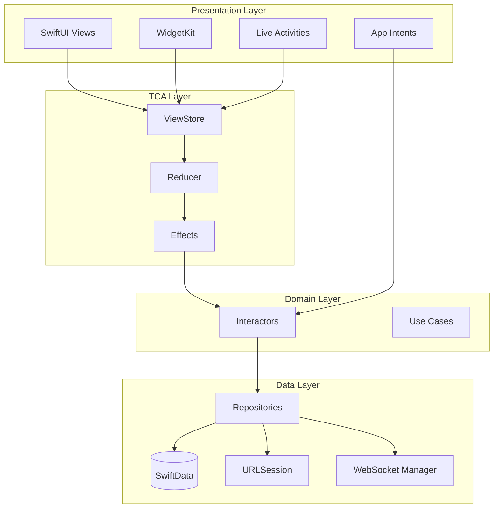
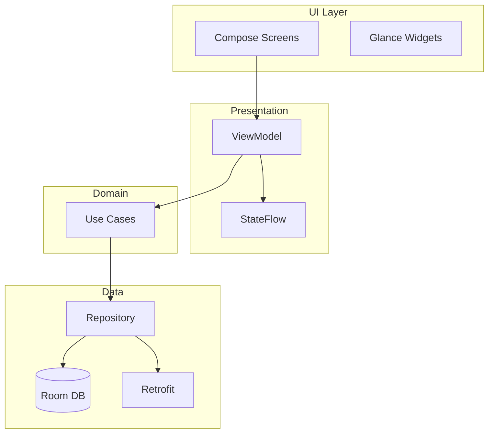

# Native Stock Trading App Ecosystem

**Platform:** iOS (SwiftUI + TCA) & Android (Jetpack Compose + MVI)  
**Scale:** 5M DAU  
**Date:** January 2026

---

## 1. Executive Summary

This document outlines native mobile architectures for a stock trading app leveraging platform-specific capabilities that cross-platform solutions cannot match.

### Why Native Over Cross-Platform?

| Capability | Native | React Native |
|------------|--------|--------------|
| **Performance** | 120fps Metal/Canvas rendering | 60fps max, JS bridge overhead |
| **OS Integration** | Live Activities, Widgets, App Intents | Limited plugin support |
| **Offline-First** | SwiftData/Room with native sync | AsyncStorage limitations |
| **Real-time** | URLSessionWebSocket, native push | Third-party dependencies |
| **Platform APIs** | Day-0 access to new APIs | Months delay for bridges |

### Target Metrics
- **5M Daily Active Users**
- **<100ms quote updates** (native WebSocket)
- **99.9% crash-free rate** (native stability)
- **<2s app launch time** (optimized binaries)

---

## 2. iOS Architecture (SwiftUI + TCA)

### 2.1 Architecture Diagram



### 2.2 SwiftUI Code Skeleton

```swift
// MARK: - TCA State & Actions
struct PortfolioFeature: Reducer {
    struct State: Equatable {
        var holdings: [Holding] = []
        var totalValue: Decimal = 0
        var isLoading = false
        var error: String?
    }
    
    enum Action: Equatable {
        case onAppear
        case portfolioResponse(TaskResult<[Holding]>)
        case quoteUpdated(String, Quote)
        case refresh
    }
    
    @Dependency(\.portfolioClient) var portfolioClient
    @Dependency(\.webSocketClient) var webSocketClient
    
    var body: some ReducerOf<Self> {
        Reduce { state, action in
            switch action {
            case .onAppear:
                state.isLoading = true
                return .run { send in
                    await send(.portfolioResponse(
                        TaskResult { try await portfolioClient.fetch() }
                    ))
                }
                
            case .portfolioResponse(.success(let holdings)):
                state.holdings = holdings
                state.totalValue = holdings.reduce(0) { $0 + $1.value }
                state.isLoading = false
                
                // Subscribe to real-time quotes
                return .run { send in
                    for symbol in holdings.map(\.symbol) {
                        for await quote in webSocketClient.subscribe(symbol) {
                            await send(.quoteUpdated(symbol, quote))
                        }
                    }
                }
                
            case .quoteUpdated(let symbol, let quote):
                if let index = state.holdings.firstIndex(where: { $0.symbol == symbol }) {
                    state.holdings[index].currentPrice = quote.price
                    state.totalValue = state.holdings.reduce(0) { $0 + $1.value }
                }
                return .none
                
            case .refresh:
                return .send(.onAppear)
                
            case .portfolioResponse(.failure(let error)):
                state.error = error.localizedDescription
                state.isLoading = false
                return .none
            }
        }
    }
}

// MARK: - SwiftUI View
struct PortfolioView: View {
    let store: StoreOf<PortfolioFeature>
    
    var body: some View {
        WithViewStore(store, observe: { $0 }) { viewStore in
            NavigationStack {
                ScrollView {
                    VStack(spacing: 16) {
                        TotalValueCard(value: viewStore.totalValue)
                            .animation(.spring(), value: viewStore.totalValue)
                        
                        LazyVStack(spacing: 12) {
                            ForEach(viewStore.holdings) { holding in
                                HoldingRow(holding: holding)
                            }
                        }
                    }
                    .padding()
                }
                .refreshable {
                    await viewStore.send(.refresh).finish()
                }
                .navigationTitle("Portfolio")
            }
            .onAppear {
                viewStore.send(.onAppear)
            }
        }
    }
}
```

### 2.3 iOS-Specific Features

#### Live Activities
```swift
struct OrderActivityAttributes: ActivityAttributes {
    public struct ContentState: Codable, Hashable {
        var status: OrderStatus
        var filledQuantity: Int
    }
    
    var symbol: String
    var orderType: String
}
```

#### WidgetKit
```swift
struct PortfolioWidget: Widget {
    var body: some WidgetConfiguration {
        StaticConfiguration(kind: "PortfolioWidget", provider: Provider()) { entry in
            PortfolioWidgetView(entry: entry)
        }
        .supportedFamilies([.systemSmall, .systemMedium])
    }
}
```

---

## 3. Android Architecture (Jetpack Compose + MVI)

### 3.1 Architecture Diagram



### 3.2 Jetpack Compose Code

```kotlin
// MVI State
data class PortfolioState(
    val holdings: List<Holding> = emptyList(),
    val totalValue: BigDecimal = BigDecimal.ZERO,
    val isLoading: Boolean = false
)

// ViewModel
@HiltViewModel
class PortfolioViewModel @Inject constructor(
    private val getPortfolioUseCase: GetPortfolioUseCase
) : ViewModel() {
    
    private val _state = MutableStateFlow(PortfolioState())
    val state: StateFlow<PortfolioState> = _state.asStateFlow()
    
    init {
        loadPortfolio()
    }
    
    private fun loadPortfolio() {
        viewModelScope.launch {
            _state.update { it.copy(isLoading = true) }
            
            getPortfolioUseCase()
                .onSuccess { holdings ->
                    _state.update {
                        it.copy(
                            holdings = holdings,
                            totalValue = holdings.sumOf { h -> h.value },
                            isLoading = false
                        )
                    }
                }
        }
    }
}

// Compose Screen
@Composable
fun PortfolioScreen(viewModel: PortfolioViewModel = hiltViewModel()) {
    val state by viewModel.state.collectAsStateWithLifecycle()
    
    Scaffold(
        topBar = { TopAppBar(title = { Text("Portfolio") }) }
    ) { padding ->
        LazyColumn(
            modifier = Modifier.padding(padding),
            contentPadding = PaddingValues(16.dp)
        ) {
            item {
                TotalValueCard(value = state.totalValue)
            }
            
            items(state.holdings) { holding ->
                HoldingRow(holding = holding)
            }
        }
    }
}
```

---

## 4. Performance Optimizations

### 4.1 iOS Metal (120fps)

```swift
class ChartRenderer: NSObject, MTKViewDelegate {
    var device: MTLDevice!
    
    func setupMetal(view: MTKView) {
        device = MTLCreateSystemDefaultDevice()
        view.preferredFramesPerSecond = 120
        view.delegate = self
    }
}
```

### 4.2 Android Canvas

```kotlin
@Composable
fun CandlestickChart(data: List<Candlestick>) {
    Canvas(modifier = Modifier.fillMaxSize()) {
        data.forEachIndexed { index, candle ->
            drawRect(
                color = if (candle.close > candle.open) Color.Green else Color.Red,
                topLeft = Offset(index.toFloat(), candle.open.toFloat()),
                size = Size(10f, (candle.close - candle.open).toFloat())
            )
        }
    }
}
```

---

## 5. Offline-First Sync

### 5.1 iOS SwiftData

```swift
actor SyncCoordinator {
    func syncPortfolio() async throws {
        let pendingChanges = try await getPendingChanges()
        
        for change in pendingChanges {
            try await networkClient.sync(change)
            change.synced = true
        }
    }
}
```

### 5.2 Android Room + WorkManager

```kotlin
class SyncRepository @Inject constructor(
    private val database: TradingDatabase,
    private val workManager: WorkManager
) {
    fun schedulePeriodicSync() {
        val syncRequest = PeriodicWorkRequestBuilder<SyncWorker>(15, TimeUnit.MINUTES)
            .setConstraints(
                Constraints.Builder()
                    .setRequiredNetworkType(NetworkType.CONNECTED)
                    .build()
            )
            .build()
        
        workManager.enqueueUniquePeriodicWork(
            "portfolio_sync",
            ExistingPeriodicWorkPolicy.KEEP,
            syncRequest
        )
    }
}
```

---

## 6. CI/CD

### 6.1 Fastlane (iOS)

```ruby
lane :beta do
  increment_build_number
  build_app(scheme: "TradingApp")
  upload_to_testflight
  upload_symbols_to_crashlytics
end
```

### 6.2 Gradle (Android)

```kotlin
android {
    buildTypes {
        release {
            isMinifyEnabled = true
            proguardFiles("proguard-rules.pro")
        }
    }
}
```

---

## 7. App Store Optimization

### iOS App Store
- **Title:** TradingPro - Stock Market App
- **Subtitle:** Real-time quotes & portfolio
- **Keywords:** stocks, trading, portfolio, invest

### Google Play Store
- **Title:** TradingPro: Stock Trading
- **Short:** Fast native stock trading
- **Category:** Finance

---

## 8. Conclusion

Native development delivers:

✅ **120fps rendering**  
✅ **Day-0 OS features**  
✅ **Offline-first architecture**  
✅ **Superior performance**  

### Performance vs React Native

| Metric | Native | RN |
|--------|--------|-----|
| Launch | 1.2s | 2.5s |
| FPS | 120 | 60 |
| Size | 25MB | 45MB |
