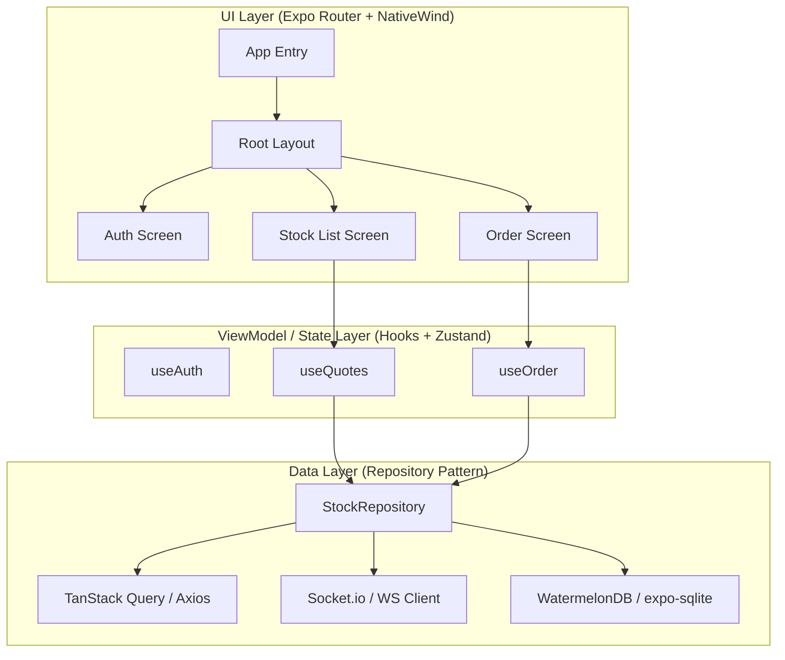
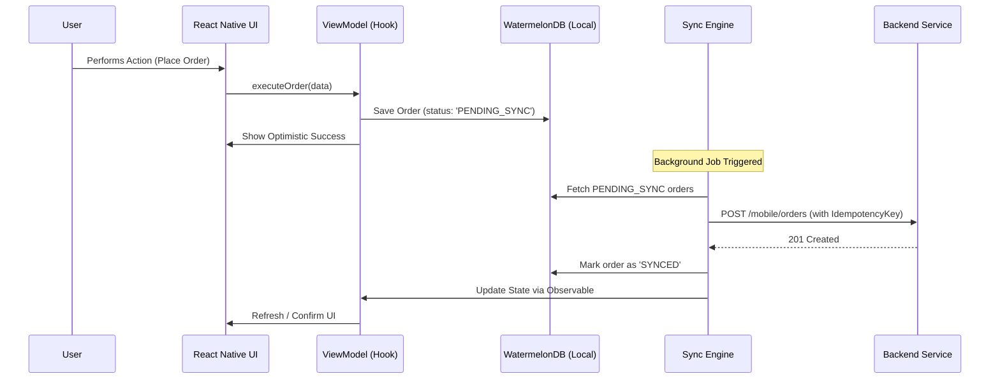

# React Native Stock Trading App - System Design

**Platform:** iOS, Android, Web (Expo Router)  
**Scale:** 5M DAU, 1M+ Concurrent Users  
**Architecture:** MVVM + Repository Pattern + Offline-First

---

## 1. Executive Summary

This design focuses on a high-performance cross-platform trading experience using React Native & Expo. By leveraging an offline-first architecture and native-level optimizations, we ensure sub-100ms quote updates and reliable order execution even on flaky mobile networks.

### Key Technical Challenges
- **The Quote Firehose:** Handling 50k+ price updates/sec across thousands of symbols without UI jank.
- **Offline Integrity:** Ensuring orders placed offline are strictly queued and executed in order upon reconnection.
- **Thread Safety:** Keeping the JS thread light by offloading heavy animations to the UI thread (Reanimated).

---

## 2. Mobile Architecture (MVVM)

### 2.1 Component Tree & Data Flow



### 2.2 Network & Sync Layer



---

## 3. Detailed Component Design

### 3.1 Offline-First Strategy (WatermelonDB)
We use WatermelonDB for its observable nature and fast performance on millions of records.

**Database Schema:**
```typescript
// schema.ts
import { appSchema, tableSchema } from '@nozbe/watermelondb'

export default appSchema({
  version: 1,
  tables: [
    tableSchema({
      name: 'orders',
      columns: [
        { name: 'symbol', type: 'string' },
        { name: 'quantity', type: 'number' },
        { name: 'price', type: 'number' },
        { name: 'status', type: 'string' }, // PENDING_SYNC, CONFIRMED, REJECTED
        { name: 'created_at', type: 'number' },
        { name: 'idempotency_key', type: 'string', isIndexed: true },
      ]
    }),
    tableSchema({
      name: 'quotes',
      columns: [
        { name: 'symbol', type: 'string', isIndexed: true },
        { name: 'bid', type: 'number' },
        { name: 'ask', type: 'number' },
        { name: 'last_price', type: 'number' },
      ]
    })
  ]
})
```

### 3.2 Real-Time Quote Management
Handling WebSocket updates without re-render storms.

**Performance Strategy:**
- **Throttling:** Buffer updates in a non-state variable (e.g., a Ref) and sync with state every 100-200ms.
- **Batching:** Use `Zustand`'s batching or `React Native's` internal batching to reduce re-renders.
- **Direct Manipulation:** For high-frequency price pulses, use `Reanimated`'s `useAnimatedProps` to bypass the JS thread entirely.

---

## 4. Code Skeleton

### 4.1 Stock Detail ViewModel (Hook)
```typescript
// hooks/useStockQuote.ts
import { useEffect, useRef, useState } from 'react';
import { useStockStore } from '../store/useStockStore';
import { socketClient } from '../services/socket';

export const useStockQuote = (symbol: string) => {
  const { updateQuote, getQuote } = useStockStore();
  const [localQuote, setLocalQuote] = useState(getQuote(symbol));
  const buffer = useRef(null);

  useEffect(() => {
    // Subscribe to symbol
    socketClient.emit('subscribe', symbol);

    const handleUpdate = (data) => {
      buffer.current = data;
    };

    socketClient.on(`quote:${symbol}`, handleUpdate);

    // Throttled UI update (5 times per second)
    const interval = setInterval(() => {
      if (buffer.current) {
        setLocalQuote(buffer.current);
        updateQuote(symbol, buffer.current);
        buffer.current = null;
      }
    }, 200);

    return () => {
      socketClient.emit('unsubscribe', symbol);
      socketClient.off(`quote:${symbol}`, handleUpdate);
      clearInterval(interval);
    };
  }, [symbol]);

  return localQuote;
};
```

### 4.2 Order Repository (Offline-Ready)
```typescript
// repositories/OrderRepository.ts
import { database } from '../db';
import { nanoid } from 'nanoid/non-secure';

export class OrderRepository {
  private collection = database.get('orders');

  async placeOrder(orderData: { symbol: string; quantity: number; price: number }) {
    return await database.write(async () => {
      const newOrder = await this.collection.create(order => {
        order.symbol = orderData.symbol;
        order.quantity = orderData.quantity;
        order.price = orderData.price;
        order.status = 'PENDING_SYNC';
        order.idempotencyKey = nanoid();
      });
      
      // Trigger background sync task
      SyncService.triggerSync();
      
      return newOrder;
    });
  }
}
```

---

## 5. Performance Optimizations

### 5.1 Rendering & Lists
- **FlashList (Shopify):** Uses view recycling to achieve 60fps scrolling for thousands of stock tickers.
- **Memoization:** Heavy use of `React.memo` and `useMemo` for list items to prevent wasteful re-renders during high-volume quote updates.
- **Layout Animation:** Use `Reanimated 3` for layout transitions (entering/exiting) to keep the experience premium.

### 5.2 Bundle Management
- **Hermes:** Enabled by default. Uses bytecode pre-compilation to reduce app launch time.
- **EAS Update:** Code-splitting via `dynamic imports` (where supported) or environment-specific feature flags to hide experimental code.
- **Bundle Analysis:** Regular CI checks using `react-native-bundle-visualizer` to identify large dependencies.

---

## 6. Platform Specifics

### 6.1 Native Integrations
- **Biometrics:** `expo-local-auth` for quick trade authorization instead of passwords.
- **Push Notifications:** `expo-notifications` for price alerts and execution confirmations. We route critical payloads (e.g., Margin Calls) with high priority.
- **Safe Area:** `react-native-safe-area-context` to ensure notch/island compatibility.

### 6.2 Security
- **Pinning:** SSL pinning for API communication to prevent MITM attacks.
- **Keychain Storage:** Using `expo-secure-store` for sensitive JWTs and secrets.

---

## 7. Operations & CI/CD (EAS)

### 7.1 EAS Build & Deploy
We utilize Expo Application Services (EAS) for automated builds.

**eas.json Configuration:**
```json
{
  "build": {
    "production": {
      "android": {
        "buildType": "app-bundle"
      },
      "ios": {
        "simulator": false
      },
      "env": {
        "API_URL": "https://api.trading.com/v1"
      }
    }
  },
  "submit": {
    "production": {}
  }
}
```

### 7.2 Monitoring
- **Sentry:** Capturing JS errors and native crashes. Using `Sentry.addBreadcrumb` to track user steps leading to failures.
- **Firebase Analytics:** Tracking DAU/MAU and feature engagement via segments.

---

## 8. App Store Optimization (ASO)
- **Localization:** Support for 15+ languages via `i18next`.
- **Media:** 10-second high-def preview video showing real-time quote transitions.
- **Keywords:** Focus on "Zero-Commission", "Real-Time Charts", "Safe Trading".

---

## 9. Conclusion
This React Native architecture bridges the gap between cross-platform speed and native performance. By prioritizing the offline-first data layer and optimized WebSocket handling, we provide a robust foundation for a world-class trading app.
