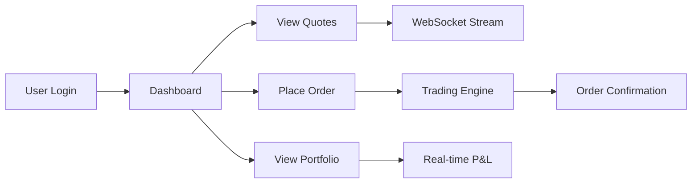
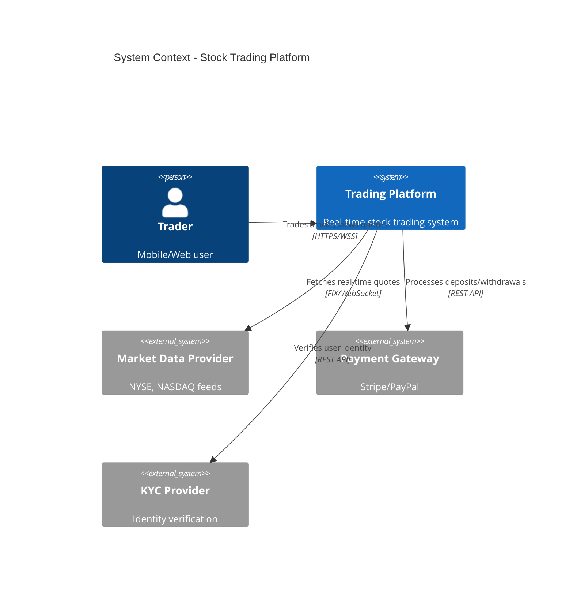
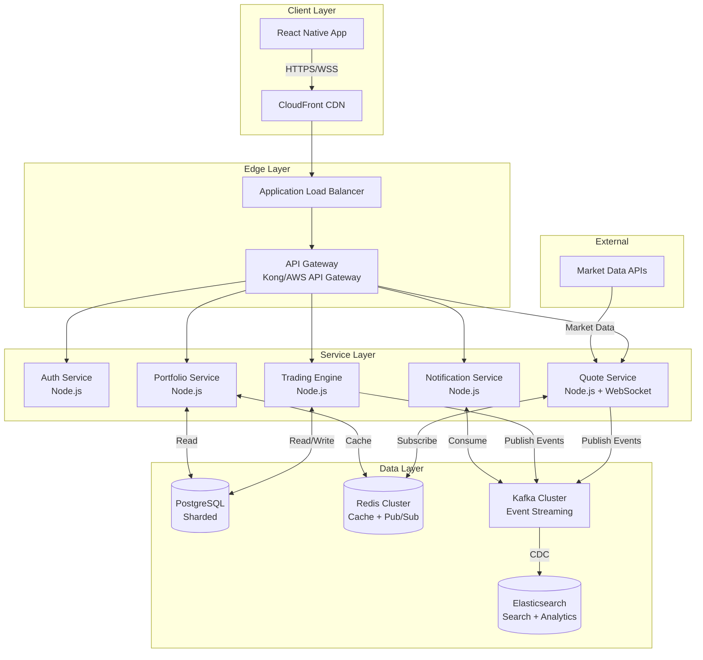
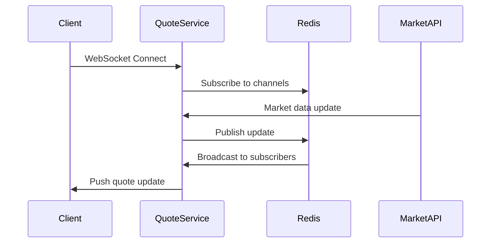
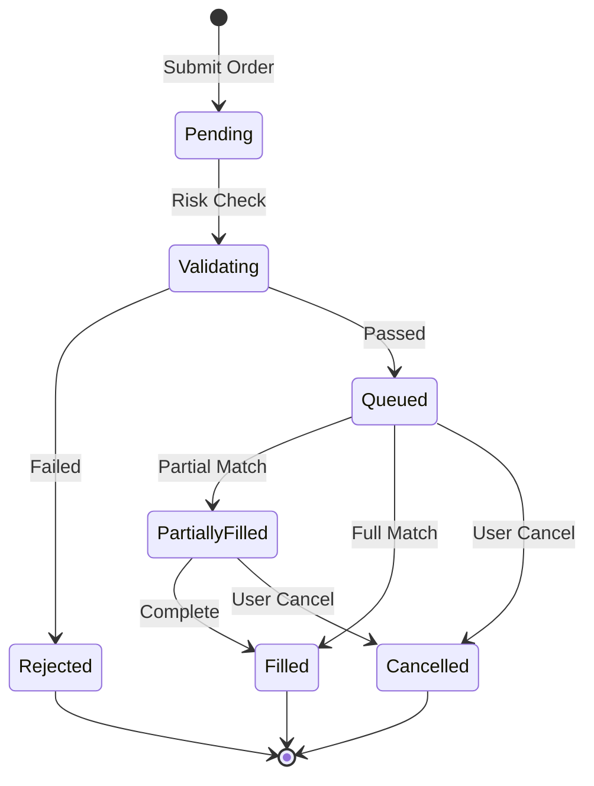
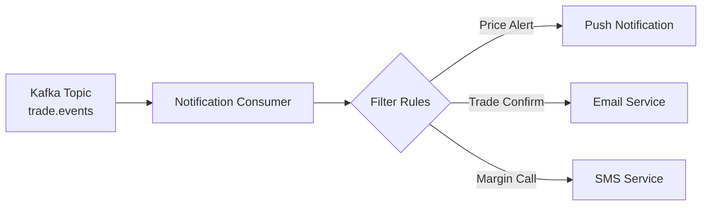
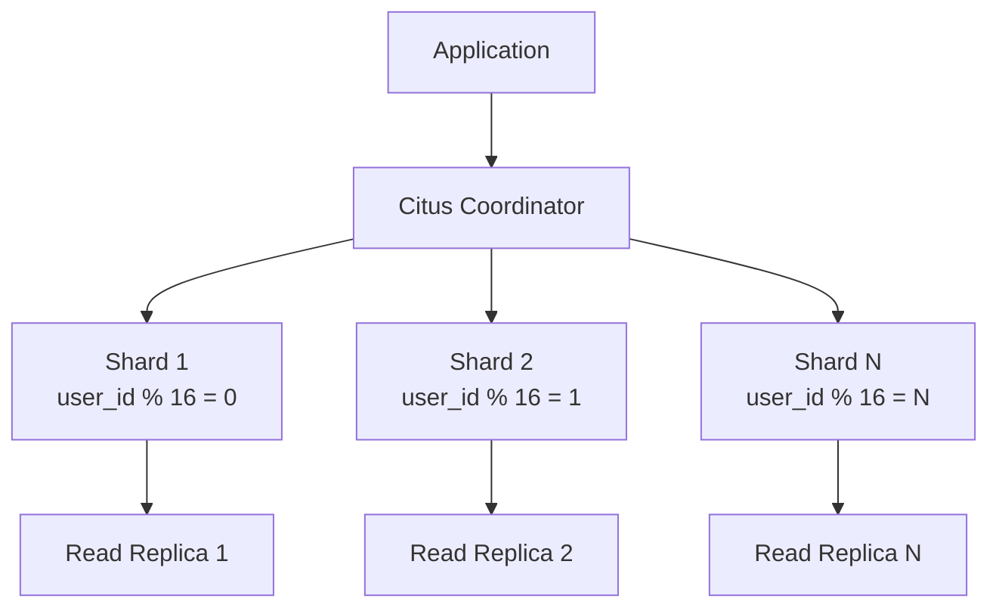
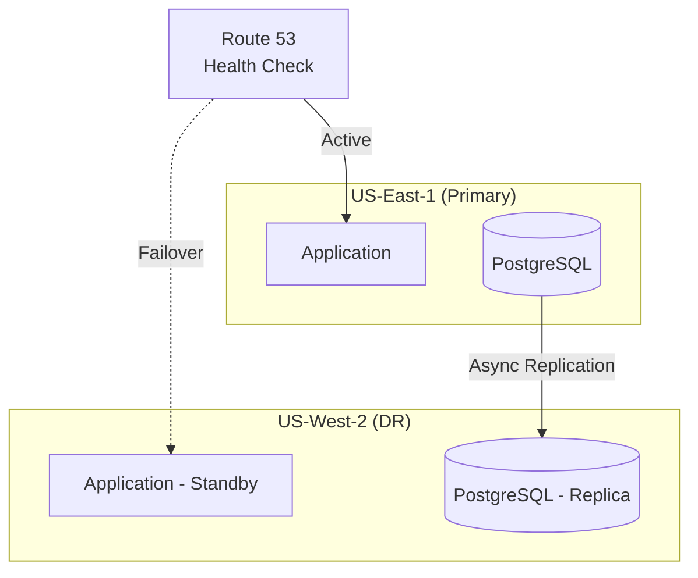
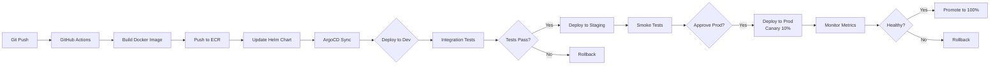

# Real-Time Stock Trading Platform - System Design Document

**Version:** 1.0  
**Target Scale:** 1M+ concurrent users, 10K TPS  
**Date:** January 2026

---

## 1. Executive Summary

This document outlines the architecture for a high-performance, real-time stock trading platform supporting 1M+ concurrent users with sub-100ms quote latency and 99.99% uptime. The system leverages microservices architecture, event-driven design, and modern cloud-native technologies.

### Key Metrics
- **Concurrent Users:** 1,000,000+
- **Trade Throughput:** 10,000 TPS
- **Quote Latency:** <100ms (p99)
- **Uptime SLA:** 99.99% (52.6 min downtime/year)
- **Data Retention:** 7 years (regulatory compliance)

---

## 2. Functional Requirements

### 2.1 Core Features

| Feature | Description | Priority |
|---------|-------------|----------|
| **User Authentication** | OAuth2/JWT-based auth, MFA support | P0 |
| **Real-Time Quotes** | WebSocket streaming, 100ms latency | P0 |
| **Order Book** | Live bid/ask spreads, depth visualization | P0 |
| **Trade Execution** | Market/limit/stop orders, sub-second execution | P0 |
| **Portfolio Tracking** | Real-time P&L, holdings, performance metrics | P0 |
| **Historical Charts** | OHLCV data, technical indicators | P1 |
| **Notifications** | Trade confirmations, price alerts, push notifications | P1 |
| **Watchlists** | Custom stock lists, multi-device sync | P2 |

### 2.2 User Flows



---

## 3. Non-Functional Requirements

### 3.1 Performance

| Metric | Target | Measurement |
|--------|--------|-------------|
| Quote Latency (p99) | <100ms | End-to-end WebSocket delivery |
| Trade Execution (p95) | <500ms | Order placement to confirmation |
| API Response Time (p95) | <200ms | REST API calls |
| WebSocket Connection Setup | <1s | Initial handshake |

### 3.2 Scalability

- **Horizontal Scaling:** Auto-scale from 10 to 500+ pods
- **Database Sharding:** User-based sharding (10M users/shard)
- **Cache Hit Ratio:** >95% for quote data
- **Kafka Throughput:** 100K events/sec per partition

### 3.3 Reliability

- **Uptime:** 99.99% (4 nines)
- **RTO:** <5 minutes (Recovery Time Objective)
- **RPO:** <1 minute (Recovery Point Objective)
- **Data Durability:** 99.999999999% (11 nines via S3)

### 3.4 Security & Compliance

- **GDPR Compliance:** Data residency, right to erasure, consent management
- **Encryption:** TLS 1.3 in transit, AES-256 at rest
- **Audit Logging:** All trades, user actions logged immutably
- **Rate Limiting:** 100 req/min per user, 1000 req/min per IP

---

## 4. System Architecture

### 4.1 High-Level Architecture (C4 Context Diagram)



### 4.2 Container Diagram



---

## 5. Detailed Component Design

### 5.1 API Gateway

**Technology:** Kong Gateway / AWS API Gateway  
**Responsibilities:**
- Authentication & authorization (JWT validation)
- Rate limiting (token bucket algorithm)
- Request routing & load balancing
- Circuit breaker pattern (fail-fast)
- API versioning & backward compatibility

**Configuration:**
```yaml
rate_limiting:
  - per_user: 100 req/min
  - per_ip: 1000 req/min
  - burst: 200

circuit_breaker:
  - failure_threshold: 50%
  - timeout: 30s
  - half_open_requests: 3
```

### 5.2 Quote Service (Real-Time Streaming)

**Architecture Pattern:** Pub/Sub with WebSocket fanout



**Key Features:**
- **WebSocket Server:** Socket.IO with sticky sessions
- **Data Source:** Aggregated from NYSE, NASDAQ via FIX protocol
- **Caching:** Redis with 1-second TTL for quote snapshots
- **Compression:** MessagePack for payload optimization
- **Throttling:** Max 10 updates/sec per symbol to clients

**Scaling Strategy:**
- Horizontal pod autoscaling (HPA) based on WebSocket connections
- Redis Cluster with 6 nodes (3 master, 3 replica)
- Connection limit: 10K connections/pod

### 5.3 Trading Engine

**Architecture:** Event-sourced order matching engine



**Components:**
1. **Order Validator:** Pre-trade risk checks (buying power, position limits)
2. **Matching Engine:** FIFO price-time priority matching
3. **Execution Gateway:** Routes to broker APIs (Alpaca, Interactive Brokers)
4. **Event Publisher:** Publishes order events to Kafka

**Performance Optimizations:**
- In-memory order book (Redis Sorted Sets)
- Optimistic locking for concurrent order updates
- Async event publishing (fire-and-forget)
- Database connection pooling (100 connections/pod)

### 5.4 Portfolio Service

**Data Model:**
```sql
-- Sharded by user_id (consistent hashing)
CREATE TABLE portfolios (
    user_id BIGINT,
    symbol VARCHAR(10),
    quantity DECIMAL(18,8),
    avg_cost DECIMAL(18,4),
    realized_pnl DECIMAL(18,2),
    updated_at TIMESTAMP,
    PRIMARY KEY (user_id, symbol)
) PARTITION BY HASH(user_id);

CREATE INDEX idx_user_updated ON portfolios(user_id, updated_at);
```

**Caching Strategy:**
- Cache entire portfolio per user (Redis Hash)
- TTL: 60 seconds
- Cache invalidation on trade execution (event-driven)

### 5.5 Notification Service

**Channels:**
- **Push Notifications:** Firebase Cloud Messaging (FCM)
- **Email:** AWS SES with templating
- **SMS:** Twilio for critical alerts

**Event Processing:**


---

## 6. Data Layer Design

### 6.1 PostgreSQL Sharding Strategy

**Sharding Key:** `user_id` (consistent hashing)  
**Shard Count:** 16 shards (supports 160M users at 10M/shard)



**Read Replica Strategy:**
- 2 read replicas per shard (async replication)
- Read-write split: Writes to master, reads from replicas
- Replication lag monitoring (<1 second acceptable)

### 6.2 Redis Architecture

**Cluster Configuration:**
- 6 nodes (3 master, 3 replica)
- 16,384 hash slots distributed across masters
- Automatic failover with Redis Sentinel

**Use Cases:**
| Use Case | Data Structure | TTL | Eviction Policy |
|----------|----------------|-----|-----------------|
| Quote Cache | String | 1s | volatile-ttl |
| Session Store | Hash | 24h | noeviction |
| Rate Limiting | Sorted Set | 1min | volatile-ttl |
| Pub/Sub | Pub/Sub | N/A | N/A |

### 6.3 Kafka Event Streaming

**Topics:**
```yaml
topics:
  - name: trade.events
    partitions: 32
    replication: 3
    retention: 7 days
    
  - name: quote.updates
    partitions: 64
    replication: 3
    retention: 1 day
    
  - name: user.actions
    partitions: 16
    replication: 3
    retention: 30 days
```

**Partitioning Strategy:**
- Partition by `user_id` for trade events (ordering guarantee)
- Partition by `symbol` for quote updates (parallelism)

### 6.4 Elasticsearch

**Indices:**
- `trades-YYYY-MM`: Historical trade data (time-series)
- `analytics-YYYY-MM`: Aggregated metrics
- `audit-logs-YYYY-MM`: Compliance logs

**Retention:** 7 years (regulatory requirement)  
**Cluster:** 6 data nodes, 3 master nodes

---

## 7. Capacity Planning & Calculations

### 7.1 Traffic Estimates

**Peak Load Assumptions:**
- 1M concurrent users
- 30% actively trading (300K)
- Average 10 trades/user/day
- Quote updates: 5K symbols × 10 updates/sec = 50K updates/sec

### 7.2 QPS Calculations

| Service | QPS (Avg) | QPS (Peak) | Notes |
|---------|-----------|------------|-------|
| Quote Service | 50K | 100K | WebSocket messages/sec |
| Trading Engine | 3K | 10K | Trade executions/sec |
| Portfolio Service | 10K | 30K | Portfolio reads |
| Auth Service | 500 | 2K | Login/token refresh |

### 7.3 Storage Calculations

**PostgreSQL:**
```
Users: 10M × 1KB = 10GB
Trades: 3M trades/day × 500B × 365 days = 547GB/year
Portfolios: 10M users × 50 holdings × 200B = 100GB
Total (3 years): ~2TB (with indexes: ~6TB)
```

**Kafka:**
```
Trade events: 3M/day × 1KB × 7 days = 21GB
Quote updates: 50K/sec × 500B × 86400s × 1 day = 2.16TB
Total: ~2.2TB
```

**Elasticsearch:**
```
Audit logs: 10M users × 100 actions/day × 2KB × 365 days × 7 years = 51TB
```

### 7.4 Compute Resources

**Kubernetes Cluster:**
```yaml
Node Pools:
  - name: services
    instance_type: c6i.4xlarge (16 vCPU, 32GB RAM)
    min_nodes: 20
    max_nodes: 200
    
  - name: quote-streaming
    instance_type: c6i.8xlarge (32 vCPU, 64GB RAM)
    min_nodes: 10
    max_nodes: 100
```

**Pod Allocation (Peak):**
- Quote Service: 50 pods × 4 vCPU = 200 vCPU
- Trading Engine: 30 pods × 2 vCPU = 60 vCPU
- Portfolio Service: 20 pods × 2 vCPU = 40 vCPU
- Other Services: 20 pods × 2 vCPU = 40 vCPU
- **Total:** ~340 vCPU (22 c6i.4xlarge nodes)

---

## 8. Scalability Strategy

### 8.1 Auto-Scaling Policies

**Horizontal Pod Autoscaler (HPA):**
```yaml
quote-service:
  metric: websocket_connections
  target: 8000 connections/pod
  min_replicas: 10
  max_replicas: 100
  scale_up_stabilization: 60s
  scale_down_stabilization: 300s

trading-engine:
  metric: cpu_utilization
  target: 70%
  min_replicas: 5
  max_replicas: 50
```

**Cluster Autoscaler:**
- Scale up: When pod pending >2 minutes
- Scale down: When node utilization <50% for >10 minutes

### 8.2 Database Scaling

**Vertical Scaling:**
- Start: db.r6g.2xlarge (8 vCPU, 64GB)
- Scale to: db.r6g.8xlarge (32 vCPU, 256GB)

**Horizontal Scaling:**
- Add shards when user count exceeds 8M/shard
- Reshard using Citus rebalancer (zero downtime)

### 8.3 Caching Strategy

**Multi-Layer Cache:**
```
L1: Application In-Memory (Node.js) - 10ms
L2: Redis Cluster - 1-5ms
L3: PostgreSQL Read Replicas - 10-50ms
L4: PostgreSQL Master - 50-200ms
```

---

## 9. Reliability & Failure Scenarios

### 9.1 Failure Modes & Recovery

| Failure Scenario | Impact | Detection | Recovery | RTO |
|------------------|--------|-----------|----------|-----|
| **Pod Crash** | Partial service degradation | Kubernetes liveness probe | Auto-restart, traffic reroute | <30s |
| **Node Failure** | Multiple pod loss | Node NotReady status | Pods rescheduled to healthy nodes | <2min |
| **AZ Outage** | 33% capacity loss | Health checks fail | Traffic routed to other AZs | <1min |
| **Database Master Failure** | Write unavailability | Patroni health check | Automatic failover to replica | <1min |
| **Redis Cluster Failure** | Cache miss storm | Sentinel monitoring | Failover to replica, circuit breaker | <30s |
| **Kafka Broker Failure** | Event processing delay | Broker offline alert | Kafka rebalances partitions | <2min |

### 9.2 Circuit Breaker Pattern

```javascript
// Example: Trading Engine calling Market Data API
const circuitBreaker = {
  failureThreshold: 5,      // Open after 5 failures
  successThreshold: 2,      // Close after 2 successes
  timeout: 30000,           // 30s timeout
  resetTimeout: 60000       // Try again after 60s
};
```

### 9.3 Disaster Recovery

**Backup Strategy:**
- PostgreSQL: Continuous WAL archiving to S3, daily snapshots
- Redis: RDB snapshots every 5 minutes
- Kafka: Replication factor 3, min in-sync replicas 2

**Multi-Region Setup (Future):**


---

## 10. Monitoring & Observability

### 10.1 Metrics (Prometheus)

**Golden Signals:**
```yaml
Latency:
  - quote_delivery_latency_p99
  - trade_execution_latency_p95
  - api_response_time_p95

Traffic:
  - websocket_connections_total
  - http_requests_per_second
  - trades_per_second

Errors:
  - http_errors_5xx_rate
  - trade_rejection_rate
  - websocket_disconnection_rate

Saturation:
  - cpu_utilization_percent
  - memory_utilization_percent
  - database_connection_pool_usage
```

### 10.2 Dashboards (Grafana)

1. **Executive Dashboard:** SLA metrics, user count, revenue
2. **Service Health:** Error rates, latency, throughput per service
3. **Infrastructure:** CPU, memory, disk, network per node
4. **Business Metrics:** Trades/day, trading volume, top symbols

### 10.3 Alerting (PagerDuty)

**Severity Levels:**
- **P0 (Critical):** Service down, data loss, security breach → Page on-call
- **P1 (High):** SLA breach, elevated error rate → Slack + email
- **P2 (Medium):** Performance degradation → Slack notification
- **P3 (Low):** Capacity warnings → Email digest

### 10.4 Distributed Tracing (Jaeger)

**Trace Critical Paths:**
- User login → JWT issuance
- Quote subscription → WebSocket delivery
- Order placement → Execution → Confirmation

---

## 11. Security & Compliance

### 11.1 GDPR Compliance

| Requirement | Implementation |
|-------------|----------------|
| **Right to Access** | User data export API (JSON format) |
| **Right to Erasure** | Soft delete with anonymization job |
| **Data Portability** | CSV/JSON export of all user data |
| **Consent Management** | Granular consent flags in user profile |
| **Data Residency** | EU users → eu-west-1, US users → us-east-1 |

### 11.2 Security Measures

**Authentication:**
- OAuth 2.0 + OpenID Connect
- JWT with 15-minute expiry, refresh tokens (7 days)
- MFA via TOTP (Google Authenticator)

**Authorization:**
- Role-Based Access Control (RBAC)
- Roles: Admin, Trader, Viewer, Auditor

**Data Protection:**
- TLS 1.3 for all external traffic
- mTLS for inter-service communication (Istio)
- AES-256 encryption at rest (AWS KMS)
- PII encryption in database (application-level)

**Audit Logging:**
```json
{
  "event_id": "evt_123",
  "timestamp": "2026-01-11T16:25:00Z",
  "user_id": "usr_456",
  "action": "PLACE_ORDER",
  "resource": "orders/789",
  "ip_address": "203.0.113.42",
  "user_agent": "TradingApp/2.1.0",
  "result": "SUCCESS"
}
```

---

## 12. Deployment Architecture

### 12.1 Kubernetes + Istio

**Cluster Configuration:**
```yaml
apiVersion: v1
kind: Cluster
metadata:
  name: trading-platform-prod
spec:
  version: 1.28
  region: us-east-1
  availability_zones: [us-east-1a, us-east-1b, us-east-1c]
  
  node_groups:
    - name: services
      instance_type: c6i.4xlarge
      desired_capacity: 30
      min_size: 20
      max_size: 200
      
  addons:
    - istio-1.20
    - prometheus-operator
    - cert-manager
```

**Istio Service Mesh:**
- Mutual TLS between services
- Traffic management (canary deployments)
- Circuit breaking & retries
- Observability (metrics, traces, logs)

### 12.2 CI/CD Pipeline (ArgoCD)



**Deployment Strategy:**
- **Dev:** Auto-deploy on merge to `main`
- **Staging:** Auto-deploy after dev tests pass
- **Production:** Manual approval + canary deployment (10% → 50% → 100%)

### 12.3 Infrastructure as Code

**Terraform Modules:**
```
terraform/
├── modules/
│   ├── eks-cluster/
│   ├── rds-postgres/
│   ├── elasticache-redis/
│   ├── msk-kafka/
│   └── elasticsearch/
├── environments/
│   ├── dev/
│   ├── staging/
│   └── prod/
└── main.tf
```

---

## 13. Cost Estimation (AWS)

### 13.1 Monthly Cost Breakdown

| Service | Configuration | Monthly Cost |
|---------|--------------|--------------|
| **EKS Cluster** | Control plane | $73 |
| **EC2 (Services)** | 30× c6i.4xlarge (reserved) | $6,480 |
| **EC2 (Quote Streaming)** | 10× c6i.8xlarge (on-demand) | $4,320 |
| **RDS PostgreSQL** | 16× db.r6g.4xlarge (multi-AZ) | $17,280 |
| **ElastiCache Redis** | 6× cache.r6g.2xlarge | $3,456 |
| **MSK Kafka** | 6× kafka.m5.2xlarge | $4,320 |
| **Elasticsearch** | 9× r6g.2xlarge.search | $5,832 |
| **ALB** | 3× ALB (100GB/day) | $150 |
| **CloudFront** | 10TB egress | $850 |
| **S3 Storage** | 50TB (backups, logs) | $1,150 |
| **Data Transfer** | 20TB/month | $1,800 |
| **CloudWatch** | Logs + metrics | $500 |
| **Route 53** | Hosted zones + queries | $100 |
| **Misc** | Secrets Manager, KMS, etc. | $300 |
| **TOTAL** | | **$46,611/month** |

### 13.2 Cost Optimization Strategies

1. **Reserved Instances:** 40% savings on baseline capacity
2. **Spot Instances:** Use for non-critical batch jobs (70% savings)
3. **Auto-Scaling:** Scale down during off-peak hours (30% reduction)
4. **S3 Lifecycle:** Move old data to Glacier (90% cheaper)
5. **CloudFront:** Optimize cache hit ratio (reduce origin requests)

**Projected Annual Cost:** ~$560K (with optimizations)

---

## 14. Technology Stack Summary

### 14.1 Frontend
- **Framework:** React Native 0.73
- **State Management:** Redux Toolkit + RTK Query
- **WebSocket Client:** Socket.IO Client
- **Charts:** Lightweight Charts (TradingView)
- **UI Library:** React Native Paper

### 14.2 Backend
- **Runtime:** Node.js 20 LTS
- **Framework:** Express.js 5
- **Language:** TypeScript 5.3
- **WebSocket:** Socket.IO 4.6
- **Validation:** Zod
- **ORM:** Prisma 5.8

### 14.3 Infrastructure
- **Container Orchestration:** Kubernetes 1.28
- **Service Mesh:** Istio 1.20
- **API Gateway:** Kong 3.5
- **Load Balancer:** AWS ALB
- **CDN:** CloudFront

### 14.4 Data Stores
- **Primary Database:** PostgreSQL 16 (Citus for sharding)
- **Cache:** Redis 7.2 (Cluster mode)
- **Event Streaming:** Apache Kafka 3.6 (AWS MSK)
- **Search & Analytics:** Elasticsearch 8.11
- **Object Storage:** AWS S3

### 14.5 Observability
- **Metrics:** Prometheus + Grafana
- **Logging:** Fluentd → Elasticsearch → Kibana
- **Tracing:** Jaeger
- **APM:** Datadog (optional)
- **Alerting:** PagerDuty

### 14.6 CI/CD
- **Version Control:** GitHub
- **CI:** GitHub Actions
- **CD:** ArgoCD
- **IaC:** Terraform
- **Container Registry:** AWS ECR

---

## 15. Deployment Scripts

### 15.1 Kubernetes Deployment Example

```yaml
# quote-service-deployment.yaml
apiVersion: apps/v1
kind: Deployment
metadata:
  name: quote-service
  namespace: trading
spec:
  replicas: 10
  selector:
    matchLabels:
      app: quote-service
  template:
    metadata:
      labels:
        app: quote-service
        version: v1
    spec:
      containers:
      - name: quote-service
        image: 123456789.dkr.ecr.us-east-1.amazonaws.com/quote-service:v1.2.3
        ports:
        - containerPort: 3000
          name: http
        - containerPort: 3001
          name: websocket
        env:
        - name: REDIS_URL
          valueFrom:
            secretKeyRef:
              name: redis-credentials
              key: url
        - name: KAFKA_BROKERS
          value: "kafka-broker-1:9092,kafka-broker-2:9092"
        resources:
          requests:
            cpu: 2000m
            memory: 4Gi
          limits:
            cpu: 4000m
            memory: 8Gi
        livenessProbe:
          httpGet:
            path: /health
            port: 3000
          initialDelaySeconds: 30
          periodSeconds: 10
        readinessProbe:
          httpGet:
            path: /ready
            port: 3000
          initialDelaySeconds: 10
          periodSeconds: 5
---
apiVersion: v1
kind: Service
metadata:
  name: quote-service
  namespace: trading
spec:
  selector:
    app: quote-service
  ports:
  - name: http
    port: 80
    targetPort: 3000
  - name: websocket
    port: 3001
    targetPort: 3001
  type: ClusterIP
---
apiVersion: autoscaling/v2
kind: HorizontalPodAutoscaler
metadata:
  name: quote-service-hpa
  namespace: trading
spec:
  scaleTargetRef:
    apiVersion: apps/v1
    kind: Deployment
    name: quote-service
  minReplicas: 10
  maxReplicas: 100
  metrics:
  - type: Resource
    resource:
      name: cpu
      target:
        type: Utilization
        averageUtilization: 70
  - type: Pods
    pods:
      metric:
        name: websocket_connections
      target:
        type: AverageValue
        averageValue: "8000"
```

### 15.2 Terraform Infrastructure

```hcl
# main.tf - EKS Cluster
module "eks" {
  source  = "terraform-aws-modules/eks/aws"
  version = "~> 19.0"

  cluster_name    = "trading-platform-prod"
  cluster_version = "1.28"

  vpc_id     = module.vpc.vpc_id
  subnet_ids = module.vpc.private_subnets

  eks_managed_node_groups = {
    services = {
      min_size     = 20
      max_size     = 200
      desired_size = 30

      instance_types = ["c6i.4xlarge"]
      capacity_type  = "ON_DEMAND"

      labels = {
        workload = "services"
      }

      taints = []
    }

    quote_streaming = {
      min_size     = 10
      max_size     = 100
      desired_size = 15

      instance_types = ["c6i.8xlarge"]
      capacity_type  = "SPOT"

      labels = {
        workload = "quote-streaming"
      }

      taints = [{
        key    = "workload"
        value  = "quote-streaming"
        effect = "NoSchedule"
      }]
    }
  }

  tags = {
    Environment = "production"
    Project     = "trading-platform"
  }
}

# RDS PostgreSQL
module "rds" {
  source = "./modules/rds-postgres"

  identifier = "trading-db-shard-1"
  
  engine_version = "16.1"
  instance_class = "db.r6g.4xlarge"
  
  allocated_storage     = 1000
  max_allocated_storage = 5000
  storage_encrypted     = true
  
  multi_az               = true
  backup_retention_period = 30
  
  vpc_id     = module.vpc.vpc_id
  subnet_ids = module.vpc.database_subnets
  
  parameters = [
    {
      name  = "max_connections"
      value = "1000"
    },
    {
      name  = "shared_buffers"
      value = "32GB"
    }
  ]
}

# ElastiCache Redis
module "redis" {
  source = "./modules/elasticache-redis"

  cluster_id = "trading-redis"
  
  node_type            = "cache.r6g.2xlarge"
  num_cache_nodes      = 6
  parameter_group_name = "default.redis7.cluster.on"
  
  engine_version = "7.0"
  port           = 6379
  
  automatic_failover_enabled = true
  multi_az_enabled          = true
  
  subnet_ids = module.vpc.elasticache_subnets
  
  snapshot_retention_limit = 5
  snapshot_window         = "03:00-05:00"
}
```

---

## 16. Conclusion

This system design provides a robust, scalable, and compliant architecture for a real-time stock trading platform capable of supporting 1M+ concurrent users with sub-100ms latency and 99.99% uptime.

### Key Strengths
✅ **Microservices architecture** enables independent scaling and deployment  
✅ **Event-driven design** with Kafka ensures loose coupling and auditability  
✅ **Multi-layer caching** (Redis + in-memory) achieves <100ms quote latency  
✅ **Database sharding** supports horizontal scaling to 100M+ users  
✅ **Kubernetes + Istio** provides auto-scaling, resilience, and observability  
✅ **GDPR compliance** built-in with data residency and audit logging  

### Future Enhancements
- Multi-region active-active deployment for global users
- Machine learning for fraud detection and trade recommendations
- Blockchain integration for settlement and custody
- Advanced order types (iceberg, TWAP, VWAP)

---

**Document Status:** Ready for technical review  
**Next Steps:** Architecture review → Proof of concept → Phased implementation
